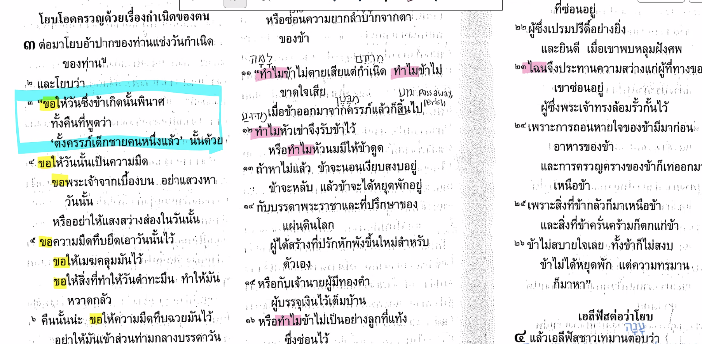
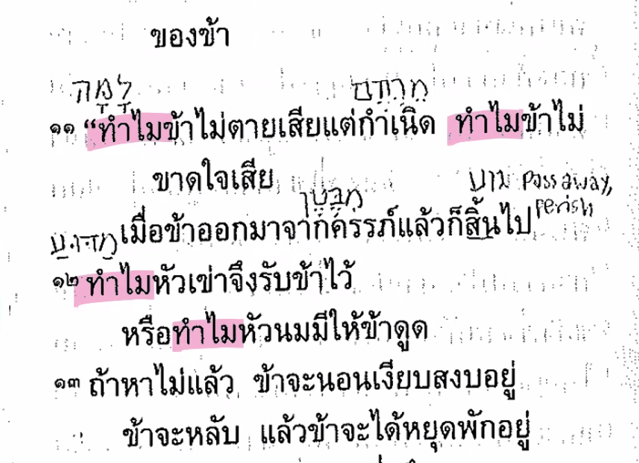
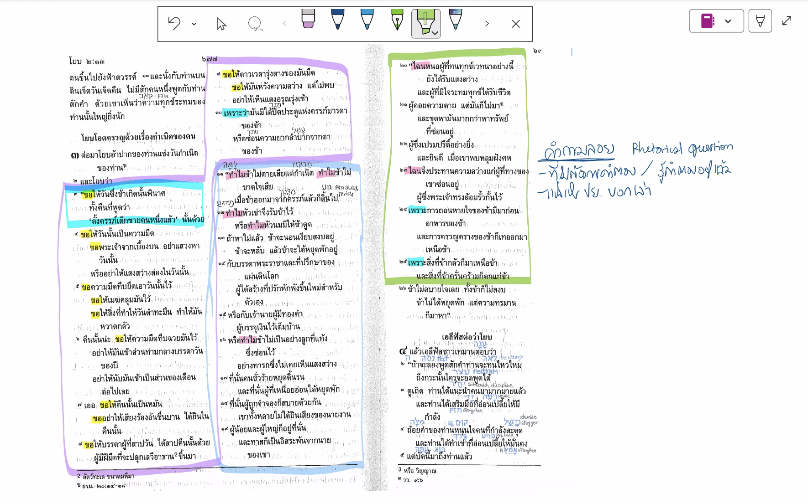
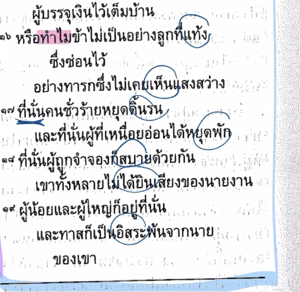

วิดีโอนี้เป็นตอนที่ 2 ของซีรีส์ศึกษา **พระธรรมโยบ** โดยทีม *ฉุใจ (Choojai Project)* ซึ่งเจาะลึกบทที่ 3 หลังจากที่โยบต้องเผชิญกับหายนะและการสูญเสีย ทั้งทรัพย์สิน บุตร และสุขภาพ โดยมีสรุปประเด็นสำคัญดังนี้:

* **ความเงียบ 7 วัน (04:00 - 13:55):** การที่โยบและเพื่อนทั้ง 3 คนนั่งเงียบกันเป็นเวลา 7 วัน สะท้อนถึงช่วงเวลาที่ความคิดและความเชื่อในใจของโยบกำลังตกตะกอนและอัดอั้นก่อนที่จะเปิดเผยออกมา
* **เพื่อนของโยบ (13:55 - 24:50):** มีการพูดถึงที่มาของเพื่อนทั้ง 3 คน ซึ่งเป็นตัวแทนของภูมิปัญญาในโลกตะวันออกสมัยโบราณ แต่ละคนถือเป็น "เสียง" (Polyphony) ที่สะท้อนมุมมองและศาสนศาสตร์ที่แตกต่างกัน
* **บทกวีแห่งการสาปแช่ง (28:00 - 37:00):** โยบเริ่มเปิดปากด้วยการสาปแช่งวันเกิดของตนเอง โดยใช้ภาษาที่ย้อนแย้งกับการทรงสร้างใน *ปฐมกาล* เพื่อแสดงถึงความเจ็บปวดลึกๆ ที่เขาอยากให้การมีอยู่ของตนกลับกลายเป็นความมืดมน
* **การเปิดโปงสิ่งที่อยู่ในใจ (37:00 - 52:56):** โยบไม่ได้เจ็บปวดเพียงเพราะการสูญเสีย แต่เขาสับสนและผิดหวังใน **พระเจ้า** เมื่อสิ่งที่เขาเคยยึดถือว่า "คนดีจะได้รับพร" ไม่เป็นจริงในชีวิตเขา ทำให้เขารู้สึกว่าพระเจ้าไม่ยุติธรรม
* **ในความเจ็บปวดจงยึดมั่นในพระเจ้า (01:01:36 - 01:15:19):** บทเรียนสำคัญคือเมื่อเผชิญวิกฤต มนุษย์มักจะมีมุมมองที่บิดเบือนไปจากความเป็นจริง แต่พระเจ้าทรงเข้าใจความเจ็บปวดนั้น ดังที่เห็นได้จาก *พระเยซูคริสต์* ที่บนไม้กางเขนก็ทรงถามคำถามเดียวกับโยบ เพื่อรื้อฟื้นความสัมพันธ์ที่แท้จริงระหว่างมนุษย์กับพระเจ้า

**ข้อคิดสรุป:** ในช่วงเวลาที่สับสนและผิดหวัง หากเราไม่เข้าใจในสิ่งที่เกิดขึ้น ขอให้เรายังคงยึดมั่นในลักษณะของพระเจ้า คือความดีงาม พระปัญญา และการครอบครองของพระองค์ แทนที่จะปลงหรือสิ้นหวัง

สรุปคำตอบสำหรับคำถามประจำสัปดาห์จากเนื้อหาในรายการพระคัมภีร์ไม่ไหลย้อนกลับ ตอน โยบ ep.2 มีรายละเอียดดังนี้ครับ:

1. **การระบุชื่อเพื่อนและที่มา (14:14 - 24:50):** การระบุชื่อและภูมิลำเนา (เช่น เอลีฟัสชาวเทมาน, บิลดัดชาวชูอา, โศฟาร์ชาวนาอาเม) ไม่ใช่เพียงแค่การแนะนำตัวละคร แต่เป็นการสะท้อนว่าพวกเขาคือ **"ตัวแทนของปัญญาที่ดีที่สุดในยุคนั้น"** เพื่อนทั้ง 3 คนมาจากตะวันออก ซึ่งในโลกโบราณถือเป็นแหล่งแห่งสติปัญญาและปรัชญา การที่มีเพื่อน 3 คนตามธรรมเนียมโบราณคือการรวมพยานผู้มีปัญญาเพื่อมาตอบคำถามหรือให้คำปรึกษาเกี่ยวกับวิกฤตที่โยบกำลังเผชิญ

2. **ทำไมโยบถึงเงียบไป 7 วัน (04:00 - 06:20, 12:45 - 13:55):** ความเงียบไม่ได้เป็นเพียงการไว้ทุกข์ตามธรรมเนียม แต่เป็นช่วงเวลาที่โยบกำลังครุ่นคิดและอัดอั้น ก่อนที่จะระเบิดความรู้สึกที่แท้จริงออกมาในบทที่ 3 การที่เพื่อนๆ เงียบด้วยก็เป็นการรอจังหวะเพื่อจะนำเสนอ "คำตอบ" ของพวกเขาว่าเหตุใดโยบจึงต้องเจอกับหายนะ

3. **สิ่งที่โยบกลัวจากการพยายาม "รอบคอบ" (46:38 - 48:54):** การที่โยบตื่นแต่เช้าเพื่อถวายเครื่องเผาบูชาเผื่อลูกๆ สะท้อนว่าโยบมีสมการชีวิตที่ยึดถือว่า **"ถ้าทำดี พระเจ้าจะอวยพร / ถ้าทำบาป พระเจ้าจะลงโทษ"** ดังนั้นสิ่งที่โยบกลัวที่สุดคือ **พระเจ้าลงโทษ** เขาจึงพยายามป้องกันไว้ก่อนด้วยการถวายบูชาเผื่อลูกๆ เพื่อไม่ให้พระเจ้าพิโรธลูกของเขา

4. **การระเบิดอารมณ์ต่อพระเจ้าและการไม่ถูกลงโทษ (52:56 - 54:20, 1:12:42 - 1:13:35):** แม้โยบจะคร่ำครวญและตัดพ้ออย่างรุนแรง แต่พระเจ้ากลับไม่ลงโทษโยบ เพราะพระองค์ทรงเห็นถึง **"ความจริงใจ"** ในหัวใจของโยบ การที่โยบเอาความเจ็บปวดและความสับสนมาวางไว้ตรงหน้าพระเจ้าโดยไม่ปกปิด เป็นการสะท้อนความสัมพันธ์ที่แท้จริงระหว่างมนุษย์กับพระเจ้า คือการยอมรับว่าพระเจ้าทรงรับฟังคำร้องทุกข์ของมนุษย์ได้ และพระเยซูคริสต์เองเมื่ออยู่บนไม้กางเขนก็ทรงสะท้อนความทุกข์ที่ยิ่งใหญ่ผ่านสดุดีบทที่ 22 เพื่อรื้อฟื้นความสัมพันธ์ที่แท้จริงให้แก่เราทุกคน

ฉันอยากตาย

เมื่อเรา "ซูมลึก" เข้าไปใน **โยบ บทที่ 3 ข้อ 1–10** ซึ่งเป็นฉากที่โยบระเบิดความอัดอั้นออกมาเป็นคำแช่งสาปวันเกิดและคืนที่ตนปฏิสนธิ เราจะพบเหตุผลทางจิตวิทยา วรรณกรรม และศาสนศาสตร์ที่ลึกซึ้งว่า **ทำไมท่านจึงเลือกแช่งวันและคืนเหล่านั้น** แทนที่จะแช่งสาปสิ่งอื่น โดยวิเคราะห์ได้เป็น 4 ประเด็นหลักดังนี้ครับ:

---

## 1. การหลีกเลี่ยงที่จะ "แช่งสาปพระเจ้า" โดยตรง

นี่คือเหตุผลเชิงศาสนศาสตร์ที่สำคัญที่สุดในบริบทของพระธรรมโยบ

* **เดิมพันของเรื่อง:** ในบทที่ 1–2 ซาตานได้ท้าทายพระเจ้าไว้ว่า หากโยบสูญเสียทุกอย่าง *“เขาจะแช่งสาปพระองค์ต่อพระพักตร์อย่างแน่นอน”* * **ทางออกของโยบ:** โยบเจ็บปวดเกินกว่าจะสรรเสริญพระเจ้าในเวลานั้น แต่ท่านก็ยังยึดมั่นในความสัตย์ซื่อและเกรงกลัวพระเจ้าเกินกว่าจะเอ่ยปากแช่งสาปพระผู้สร้างโดยตรง ท่านจึงเลือก **เบี่ยงเป้าหมายของการแช่งสาปมาที่ "วันเกิด" และ "คืนปฏิสนธิ" ของตนเองแทน** เพื่อเป็นระบายความแค้นเคืองใจอย่างที่สุด โดยไม่ก้าวข้ามเส้นไปสู่การกบฏต่อพระเจ้า

---

## 2. ความปรารถนาที่จะ "ลบล้างการมีตัวตน" (De-creation)

ความทุกข์ของโยบนั้นหนักหนาสาหัสเกินกว่าที่จิตใจของมนุษย์จะแบกทานไหว (ทั้งสูญเสียลูกทั้ง 10 คน ทรัพย์สินทั้งหมด และป่วยเป็นโรคร้ายรุมเร้า) จนท่านรู้สึกว่า **"การไม่เคยมีตัวตนอยู่เลย"** ยังดีเสียกว่าการต้องทนมีชีวิตอยู่

* **การย้อนกระบวนการสร้าง:** ในภาษาเดิม โยบใช้คำแช่งสาปที่จงใจ **ลอกเลียนแอนิเมชันการสร้างโลกในปฐมกาลแบบย้อนกลับ** * ในปฐมกาล พระเจ้าตรัสว่า *"จงเกิดความสว่าง"* * แต่โยบแช่งวันเกิดของตนว่า *"ขอให้วันนั้นกลายเป็นความมืด"* (ข้อ 4) และขอให้อันตรธานหายไปจากปฏิทิน (ข้อ 6)
* โยบไม่ได้อยากฆ่าตัวตายในเวลานั้น แต่ท่านกำลังหวังให้วิญญาณของท่านย้อนเวลากลับไปสู่จุดศูนย์ เพื่อที่ค่ำคืนที่ระบุว่า *"ปฏิสนธิทารกชายคนหนึ่งแล้ว"* (ข้อ 3) จะกลายเป็นความว่างเปล่าราวกับไม่เคยเกิดขึ้น

---

## 3. ภาพสะท้อนของ "ความสิ้นหวังในอนาคต"

ในบรรดาสิ่งที่มนุษย์ครอบครอง "เวลา" คือสิ่งเดียวที่เป็นสัญลักษณ์ของอนาคตและความหวัง การที่โยบลุกขึ้นมาแช่งสาป "วันเกิด" ของตนเอง เป็นการแสดงออกเชิงสัญลักษณ์ว่า **"ชีวิตของข้าพเจ้าสิ้นสุดลงแล้ว และอนาคตไม่มีค่าให้อยู่ต่ออีกต่อไป"** สำหรับโยบ วันเกิดไม่ได้นำมาซึ่งการเฉลิมฉลองชีวิต แต่เป็นประตูมิติที่นำพาเขามาก้าวสู่ความทุกข์ระทมที่ไร้คำตอบในปัจจุบัน

---

## 4. การประชดประชันความเชื่องมงายของสังคม (กรรมฝ่ายวิญญาณ)

สังคมรอบตัวโยบ รวมถึงเพื่อนๆ ของเขา เชื่อมั่นในกฎแห่งกรรมฝ่ายวิญญาณอย่างสุดโต่ง (ทำดีได้ดี ทำชั่วต้องวิบัติทันที) เมื่อโยบวิบัติต่างๆ เพื่อนๆ จึงตราหน้าว่าเขาเป็นคนบาป

* การแช่งสาปวันเกิดเป็นการพร่ำบ่นเชิงประชดประชันว่า หากความดีงามที่เขาเพียรทำมาทั้งชีวิตไม่สามารถปกป้องเขาจากภัยพิบัติที่ไม่ยุติธรรมนี้ได้ และหากพระเจ้าจะทรงยอมให้คนสัตย์ซื่อต้องทนทุกข์ราวกับคนชั่ว เช่นนั้นแล้ว **วันแรกที่เขาได้ลืมตาดูโลกก็คือวันแห่งความอัปยศ** และไม่สมควรได้รับการจดจำอีกต่อไป

---

> **💡 บทสรุปสั้นๆ สำหรับนำไปคิดต่อหรือแบ่งปัน:**
> โยบไม่ได้แช่งสาปวันคืนเพราะความวิกลจริต แต่ท่านกำลัง **ใช้กวีนิพนธ์ร้องคร่ำครวญอย่างซื่อสัตย์ที่สุด** เพื่อระบายความเจ็บปวดอัดอั้นหน้าพระพักตร์พระเจ้า โดยเลือกแช่งสาป "วันเริ่มต้นชีวิตของตน" เพื่อหลีกเลี่ยงการแช่งสาป "พระเจ้าผู้ประทานชีวิต" ครับ

ทำไมต้องแช่งวันและคืนโดยการย้อนกลับไปถึงวันนั้น

กลางคืน=พ่อกับแม่ได้กันขอให้พินาศ

โยบไม่ได้สนับสนุนการkillตัวตาย