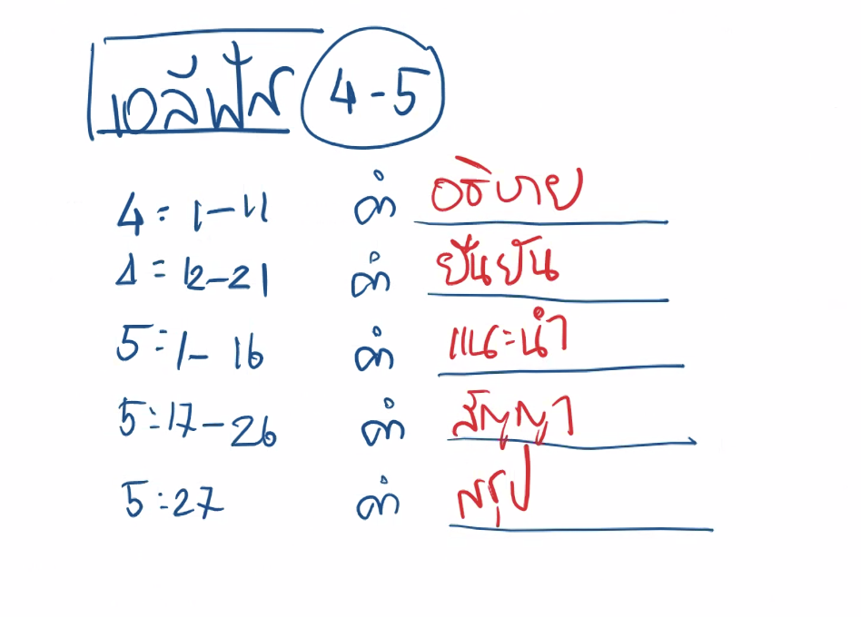
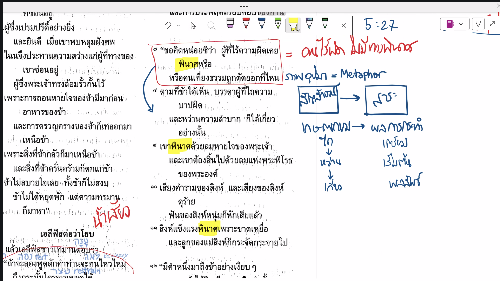

## สารบัญ
- [ภาพรวมวิดีโอ](#ภาพรวมวิดีโอ)
- [ประเด็นสำคัญของวิดีโอ](#ประเด็นสำคัญของวิดีโอ)
- [วิเคราะห์คำพูดของเอลีฟัสในโยบ 4-5](#วิเคราะห์คำพูดของเอลีฟัสในโยบ-4-5)
- [หลักการสำคัญของปัญญาเอลีฟัส](#หลักการสำคัญของปัญญาเอลีฟัส)
- [ภาพเปรียบเทียบสำคัญ](#ภาพเปรียบเทียบสำคัญ)

## ภาพรวมวิดีโอ

วิดีโอนี้เป็นตอนที่ 3 ของซีรีส์ศึกษา พระธรรมโยบ โดยทีมชูใจ ซึ่งเจาะลึกเรื่อง "สมการชีวิต" (0:00 - 1:48) ผ่านบทสนทนาระหว่างโยบและเพื่อนทั้ง 3 คน คือ เอลิฟัส, บิลดัด และ โศฟาร์ (0:00 - 9:20)

## ประเด็นสำคัญของวิดีโอ

สมการชีวิตที่ผิดเพี้ยน: (12:10)

ผู้คนในสมัยนั้น (รวมถึงเพื่อนของโยบ) เชื่อในสมการ: พระเจ้าผู้ยุติธรรม + เราทำดี = พระเจ้าต้องอวยพร
เมื่อโยบประสบหายนะ ทั้งที่เขาเป็นคนชอบธรรม สมการนี้จึงถูกเขย่า ทำให้เกิดความขัดแย้งในมุมมองระหว่างโยบและเพื่อนๆ (14:38 - 18:01)
มุมมองของเอลิฟัส: (20:30)

เอลิฟัส อ้างอิง กฎแห่งการกระทำ (หว่านอะไรก็เกี่ยวอย่างนั้น) และใช้ประสบการณ์รวมถึงภูมิปัญญาโบราณมาตัดสินว่า ความทุกข์ของโยบต้องเกิดจากความบาปที่ซ่อนอยู่ (21:20 - 23:38)
เขายืนยันว่าพระเจ้าไม่ผิด สมการไม่ผิด ดังนั้นคนที่ผิดต้องเป็นโยบ (28:01 - 31:00)
การเปิดโปงความเชื่อแบบตีกรอบ: (43:05 - 47:45)

วิดีโอนี้สะท้อนว่าบางครั้งเราก็ใช้ "กฎทั่วไป" มาตีกรอบการทำงานของพระเจ้า หากชีวิตไม่ราบรื่น เรามักจะสรุปทันทีว่าตนเองหรือคนอื่นทำผิดบาป ซึ่งพระธรรมโยบกำลังบอกว่านั่นไม่เป็นความจริงเสมอไป
สรุปบทเรียน:
เราไม่สามารถใช้ตรรกะแบบ "สาเหตุและผลลัพธ์" มาตัดสินทุกสิ่งที่พระเจ้าทำได้ ความเชื่อที่ตายตัวอาจกลายเป็นสิ่งที่ปิดกั้นการเข้าใจพระราชกิจที่เกินความเข้าใจของมนุษย์ (47:45 - 52:26)

วิดีโอนี้เป็นตอนที่ 4 ของซีรีส์ศึกษาพระธรรมโยบ ในหัวข้อ "เริ่มบทสนทนา" โดยเป็นการวิเคราะห์บทสนทนารอบแรกระหว่างโยบและเพื่อนทั้ง 3 คน (เอลิฟัส, บิลดัด และโสฟาร์) ซึ่งครอบคลุมเนื้อหาในพระธรรมโยบบทที่ 4-14

ประเด็นหลักของบทสนทนา
หัวใจสำคัญที่ทั้ง 3 คนพยายามสื่อสารกับโยบคือการหา "กติกาของชีวิต" ในโลกนี้ว่าพระเจ้าดำเนินงานอย่างไร ซึ่งสะท้อนมุมมองที่แตกต่างกันของเพื่อนแต่ละคน:

เอลิฟัส (09:49-15:36): เน้นว่าคนชอบธรรมจะไม่พินาศ ความทุกข์เป็นเหมือนการตีสอนจากพระเจ้าเพื่อพัฒนาชีวิต (คล้ายพระธรรมสุภาษิต) โดยเขาใช้ประสบการณ์ลี้ลับมาเป็นรากฐานความเชื่อ
บิลดัด (17:38-24:36): เน้นความถูกต้องชัดเจนแบบ "ขาวดำ" ว่าทำดีได้ดี ทำชั่วได้ชั่ว (กฎแห่งการกระทำ) และสรุปว่าลูกๆ ของโยบตายเพราะทำบาป ซึ่งเป็นการตัดสินที่รุนแรง
โสฟาร์ (28:50-33:42): เป็นคนที่พูดทิ่มแทงที่สุด โดยอ้างว่าตนเองเข้าใจน้ำพระทัยและสติปัญญาของพระเจ้า และตัดสินว่าโยบได้รับโทษน้อยกว่าที่ควรจะเป็นด้วยซ้ำ
บทสะท้อนและข้อคิด
ผู้ดำเนินรายการชี้ให้เห็นว่ามุมมองของเพื่อนโยบสะท้อนถึงความคิดในปัจจุบันที่มักจะ:

ลดทอนความซับซ้อนของชีวิต: ให้เหลือเพียงการทำดีเพื่อแลกกับพระพร (พระกิตติคุณแห่งความมั่งคั่ง)
ใช้ "กฎแห่งกรรม" หรือ "กฎแห่งการกระทำ": มาตัดสินคนอื่นที่กำลังเผชิญความทุกข์ ว่าต้องทำบาปหรือไม่มีความเชื่อถึงเกิดเรื่องร้าย (41:21-46:54)
การตีกรอบพระเจ้า: มนุษย์พยายามสร้างกรอบความคิดเกี่ยวกับพระเจ้าเพื่อให้รู้สึกมั่นคงและควบคุมได้ แทนที่จะวางใจในตัวพระองค์จริงๆ (47:05-51:17)
โยบในตอนตอบกลับเพื่อนๆ พยายามแย้งว่าเขาไม่ได้ทำผิด และความทุกข์ที่เกิดขึ้นนั้นไม่มีเหตุผลรองรับในเชิงตรรกะแบบที่เพื่อนพยายามยัดเยียดให้ เขาจึงเรียกร้องหาผู้กลางที่จะมาทำความเข้าใจกับพระเจ้าแทนเขา (34:10-36:35)

อะไรคือหลักการและแหล่งข้อมูลของหลักการ

4:1-11
4:12-21
5:1-16
5:17-26
5:27

พระธรรมโยบ บทที่ 4 และ 5 เป็น **สุนทรพจน์แรกของเอลีฟัส (Eliphaz)** ซึ่งเป็นเพื่อนคนแรกที่ลุกขึ้นมาพูดตอบโต้หลังจากโยบได้คร่ำครวญถึงความทุกข์ทรมานของตนเองในบทที่ 3

แก่นกลางในคำพูดของเอลีฟัสตั้งอยู่บนพื้นฐานของ **"ทฤษฎีแห่งการตอบแทน" (Retribution Theology)** ซึ่งเป็นกรอบความเชื่อหลักในยุคนั้นที่ว่า "ทำดีได้ดี ทำชั่วได้ชั่ว" พระเจ้าจะทรงอวยพรคนชอบธรรมและลงโทษคนบาปเสมอ

นี่คือการสังเกตเชิงลึกในแต่ละช่วงของพระคัมภีร์ที่คุณยกมาครับ

### 4:1-11: กฎแห่งการหว่านและการเก็บเกี่ยว (The Law of Retribution)

* **บริบท:** เอลีฟัสเริ่มต้นด้วยความเห็นอกเห็นใจ (ในระดับหนึ่ง) แต่ก็แฝงไปด้วยการตำหนิอย่างนุ่มนวล เขาเตือนความจำโยบว่า ในอดีตโยบเคยเป็นผู้ที่ให้คำปรึกษาและหนุนใจผู้ที่อ่อนแอ แต่เมื่อความทุกข์มาถึงตัว โยบกลับหมดกำลังใจและท้อแท้เสียเอง
* **การสังเกตเชิงลึก:** เอลีฟัสตั้งคำถามที่แทงใจดำว่า *"มีผู้บริสุทธิ์คนใดบ้างที่พินาศ?"* (ข้อ 7) เขากำลังใช้ตรรกะว่า คนที่ไถความบาปและหว่านความลำบากย่อมเก็บเกี่ยวสิ่งเหล่านั้น นี่เป็นการ **บอกใบ้ทางอ้อมว่าโยบจะต้องทำบาปอะไรซ่อนไว้แน่ๆ** พระเจ้าจึงทรงลงโทษเช่นนี้ เอลีฟัสใช้ประสบการณ์ส่วนตัว ("ตามที่ข้าเห็น" ในข้อ 8) มาเป็นตัวตัดสินสถานการณ์ของโยบ

### 4:12-21: นิมิตลี้ลับและความเปราะบางของมนุษย์ (Divine Transcendence & Human Frailty)

* **บริบท:** เอลีฟัสเปลี่ยนวิธีการจูงใจจากการใช้ตรรกะทั่วไป มาเป็นการอ้างสิทธิอำนาจเหนือธรรมชาติ โดยเล่าถึงประสบการณ์ลี้ลับที่เขาได้รับผ่านเสียงกระซิบในเวลากลางคืน
* **การสังเกตเชิงลึก:** ใจความสำคัญของนิมิตนี้คือ **"มนุษย์ตายตายจะชอบธรรมกว่าพระเจ้าได้หรือ?"** (ข้อ 17) เอลีฟัสเน้นย้ำถึงระยะห่างระหว่างพระเจ้าผู้ยิ่งใหญ่กับมนุษย์ที่เป็นเพียง "บ้านดินเหนียว" (เปราะบางและแตกสลายง่าย) แม้แต่ทูตสวรรค์พระเจ้ายังพบความผิดพลาดได้ นับประสาอะไรกับมนุษย์ การยกเรื่องนี้มาพูดเพื่อเป็นการเตือนสติโยบว่า อย่าคิดว่าตัวเองชอบธรรมจนถึงขั้นกล้าตัดพ้อหรือตั้งคำถามกับพระเจ้า

### 5:1-16: ชะตากรรมของคนโง่เขลาและความยุติธรรมของพระเจ้า (The Fate of the Foolish & God's Sovereign Justice)

* **บริบท:** เอลีฟัสเตือนโยบถึงอันตรายของความโกรธและความขุ่นเคืองใจ พร้อมทั้งแนะนำให้โยบหันไปหาพระเจ้า
* **การสังเกตเชิงลึก:** เอลีฟัสชี้ให้เห็นว่า "ความโกรธฆ่าคนโง่" (ข้อ 2) ซึ่งเป็นการเตือนโยบว่าการบ่นคร่ำครวญแบบในบทที่ 3 เป็นพฤติกรรมของคนโง่เขลา จากนั้นเขาได้บรรยายถึงความยิ่งใหญ่ของพระเจ้า ผู้ทรงกระทำกิจการที่ไม่อาจหยั่งรู้ได้ (ข้อ 9) เช่น การประทานฝน การขัดขวางคนเจ้าเล่ห์ และการช่วยกู้คนขัดสน เอลีฟัสกำลังบอกให้โยบ **เลิกบ่นและมอบคดีความของตนไว้กับพระเจ้าผู้ทรงยุติธรรม**

### 5:17-26: พระพรแห่งการตีสอน (The Blessing of Divine Discipline)

* **บริบท:** ช่วงนี้คือจุดเปลี่ยนจากคำเตือนมาเป็นการให้ความหวัง เอลีฟัสมองความทุกข์ในมุมมองของการขัดเกลา
* **การสังเกตเชิงลึก:** เอลีฟัสนำเสนอแนวคิดว่า ความทุกข์ที่โยบเผชิญนั้นเป็น **"การตีสอนจากองค์ผู้ทรงมหิทธิฤทธิ์"** (ข้อ 17) และคนที่ถูกพระเจ้าตีสอนนั้นย่อมเป็นสุข เพราะพระองค์ทรงทำให้เกิดบาดแผล แต่พระองค์ก็ทรงพันผูกให้ เอลีฟัสสัญญาว่าหากโยบยอมถ่อมใจรับการตีสอนและกลับใจ พระเจ้าจะทรงฟื้นฟูเขา ปกป้องเขาจากภัยพิบัติ (ความอดอยาก, สงคราม, สัตว์ร้าย) และให้เขามีชีวิตที่ยืนยาวและบริบูรณ์

### 5:27: บทสรุปที่เปี่ยมด้วยความมั่นใจ (The Confident Conclusion)

* **บริบท:** ข้อนี้คือบทสรุปปิดท้ายสุนทรพจน์ของเอลีฟัส
* **การสังเกตเชิงลึก:** *"ดูเถิด เราได้ค้นคว้าเรื่องนี้แล้ว และก็เป็นความจริงตามนั้น จงฟัง และรับรู้เพื่อประโยชน์ของท่านเองเถิด"* ประโยคนี้แสดงให้เห็นถึง **ความมั่นใจอย่างสูงสุดในภูมิปัญญาของตนเองและกลุ่มของตน** เอลีฟัสเชื่อว่าสิ่งที่เขาพูดคือความจริงแท้ที่ผ่านการพิสูจน์มาแล้ว เขาปิดโอกาสที่จะรับฟังคำอธิบายของโยบ และบีบบังคับให้โยบต้องยอมรับกรอบความคิดนี้แต่เพียงผู้เดียว

---

**สรุปภาพรวมคำพูดของเอลีฟัส:**
คำพูดของเอลีฟัสในบทที่ 4 และ 5 เต็มไปด้วย **"ความจริงทางศาสนาที่ถูกต้องในเชิงหลักการ"** (เช่น พระเจ้าทรงยุติธรรม, มนุษย์อ่อนแอ, การตีสอนของพระเจ้าเป็นสิ่งดี) แต่ปัญหาที่ยิ่งใหญ่ที่สุดคือ **เขาประยุกต์ใช้ความจริงเหล่านั้นผิดคนและผิดสถานการณ์** เพราะในความเป็นจริง (ดังที่ปรากฏในบทที่ 1 และ 2) โยบไม่ได้ทนทุกข์เพราะเขาทำบาป แต่เป็นเพราะความเชื่อฟังและความชอบธรรมของเขาต่างหาก บทสนทนานี้จึงเป็นตัวอย่างชั้นดีของการใช้หลักข้อเชื่อที่ถูกต้องอย่างปราศจากความเข้าใจและความเห็นอกเห็นใจบริบทของผู้รับฟัง

หลักการสำคัญที่เป็นแก่นกลางใน **"ปัญญา"** ของเอลีฟัส ซึ่งเขานำเสนอเพื่ออธิบายและพยายามแก้ปัญหาความทุกข์ทรมานของโยบ สามารถสรุปออกมาเป็น 4 หลักการหลัก ดังนี้ครับ

## 1. หลักการแห่งการหว่านและการเก็บเกี่ยว (The Principle of Retribution)

นี่คือเลนส์หลักที่เอลีฟัสใช้มองโลก เขาเชื่อมั่นใน "ทฤษฎีการตอบแทน" หรือกฎแห่งเหตุและผลอย่างเคร่งครัด

* **แนวคิด:** โลกนี้ทำงานภายใต้กฎเกณฑ์ทางศีลธรรมที่แน่นอน คือ **ทำดีได้ดี ทำชั่วได้ชั่ว** พระเจ้าจะทรงอวยพรคนชอบธรรมและลงโทษคนบาป
* **สิ่งที่เขานำเสนอต่อโยบ:** เขาเชื่อว่าความทุกข์ที่รุนแรงย่อมมาจากความบาปที่รุนแรง เขาจึงบอกโยบกลายๆ ว่า "คนที่หว่านความชั่วก็ต้องเก็บเกี่ยวความพินาศ" (4:8) ในปัญญาของเอลีฟัส **ไม่มีพื้นที่สำหรับคนชอบธรรมที่ต้องทนทุกข์อย่างแสนสาหัสโดยไม่มีสาเหตุ** หากโยบเจอเรื่องแย่ขนาดนี้ แปลว่าโยบต้องมีความผิดบาปบางอย่างซ่อนอยู่อย่างแน่นอน

## 2. หลักการเรื่องความบริสุทธิ์ของพระเจ้า (The Principle of God's Absolute Holiness)

เอลีฟัสยกย่องพระเจ้าในฐานะผู้ทรงสูงส่งและบริสุทธิ์เหนือสรรพสิ่ง ซึ่งนำไปสู่ข้อสรุปเกี่ยวกับมนุษย์

* **แนวคิด:** พระเจ้าทรงบริสุทธิ์และยิ่งใหญ่มากจนแม้แต่ทูตสวรรค์ก็ยังมีข้อบกพร่องในสายพระเนตรของพระองค์ แล้วมนุษย์ซึ่งเป็นแค่ "บ้านดินเหนียว" จะอ้างว่าตนเองชอบธรรมได้อย่างไร (4:17-19)
* **สิ่งที่เขานำเสนอต่อโยบ:** เอลีฟัสใช้หลักการนี้เพื่อเตือนโยบว่า อย่าคิดว่าตัวเองสมบูรณ์แบบจนกล้าเรียกร้องความยุติธรรมหรือตัดพ้อพระเจ้า มนุษย์ทุกคนล้วนมีความบาป ดังนั้นการที่โยบถูกลงโทษจึงไม่ใช่เรื่องแปลก และโยบไม่มีสิทธิ์ที่จะบอกว่าตนเองไร้ความผิด

## 3. หลักการเรื่องความทุกข์คือการตีสอน (The Principle of Divine Discipline)

เอลีฟัสนำเสนอมุมมองด้านบวก (ในแบบของเขา) เกี่ยวกับความทุกข์ เพื่อให้ความหวังแก่โยบ

* **แนวคิด:** ความทุกข์ไม่จำเป็นต้องเป็นความพินาศเสมอไป แต่อาจเป็น **"การตีสอน" (Discipline)** จากพระเจ้าที่กระทำต่อผู้ที่พระองค์ทรงรัก เพื่อให้เขารู้ตัวและกลับใจ
* **สิ่งที่เขานำเสนอต่อโยบ:** เขากระตุ้นให้โยบมองความทุกข์เป็นการตักเตือนสอนใจ (5:17) เอลีฟัสพยายามปลอบโยบว่า หากโยบยอมรับการตีสอน ถ่อมใจลง และอธิษฐานสารภาพบาปต่อพระเจ้า พระเจ้าผู้ทรงทำให้เกิดบาดแผล ก็จะทรงเป็นผู้รักษาและฟื้นฟูชีวิตของโยบให้กลับมาเจริญรุ่งเรืองอีกครั้ง

## 4. ปัญญาที่อ้างอิงจากประสบการณ์และนิมิต (Authority from Experience and Mysticism)

ปัญญาของเอลีฟัสไม่ได้มาจากการคาดเดาลอยๆ แต่เขามั่นใจในหลักการของเขาเพราะมันมีแหล่งอ้างอิง

* **แนวคิด:** เขาอาศัย **การสังเกตจากประสบการณ์ชีวิต** ("ตามที่ข้าเห็น" - 4:8) และ **นิมิตลี้ลับส่วนตัว** (เสียงกระซิบและนิมิตในยามค่ำคืน - 4:12-16) เป็นเครื่องยืนยันความรู้ของเขา
* **สิ่งที่เขานำเสนอต่อโยบ:** เอลีฟัสปิดท้ายด้วยความมั่นใจสูงสุดว่า *"เราได้ค้นคว้าเรื่องนี้แล้ว และก็เป็นความจริงตามนั้น"* (5:27) เขาเชื่อว่าปัญญาที่มาจากผู้ใหญ่ที่อาบน้ำร้อนมาก่อนและได้รับการสำแดงจากสวรรค์ เป็นสิ่งที่ถูกต้องที่สุด โยบมีหน้าที่แค่ต้อง "ฟังและรับรู้" เท่านั้น

---

**จุดบอดใน "ปัญญา" ของเอลีฟัส**
ปัญหาของเอลีฟัสไม่ได้อยู่ที่หลักการของเขาผิด (ในพระคัมภีร์หลายตอน หลักการเหล่านี้เป็นความจริง) แต่อยู่ที่ **ความแข็งกระด้างและการนำไปใช้ผิดสถานการณ์**

ปัญญาของเอลีฟัสเป็นเหมือน **"สูตรสำเร็จ" (Formulaic Wisdom)** ที่ตีกรอบการกระทำของพระเจ้าไว้แค่มิติเดียว เขาไม่ยอมรับว่าบนโลกนี้มีความซับซ้อนที่เหนือความเข้าใจของมนุษย์ เช่น โยบไม่ได้ทนทุกข์เพราะทำบาป หรือถูกตีสอน แต่ทนทุกข์เพราะเป็นสนามทดสอบความเชื่อตามพระประสงค์ของพระเจ้า (ซึ่งเอลีฟัสไม่รู้เหตุการณ์เบื้องหลังในสวรรค์เลย) การนำความจริงที่ถูกต้องไปยัดเยียดให้คนกำลังเจ็บปวดโดยปราศจากการรับฟัง ปัญญาของเขาจึงกลายเป็นการซ้ำเติมมากกว่าการเยียวยาครับ

เอลีฟัสเป็นนักพูดเชิงกวีที่ใช้ **"ภาพเปรียบเปรย" (Imagery)** ได้อย่างทรงพลังและเห็นภาพชัดเจน ภาพที่เขาใช้สะท้อนให้เห็นบริบทของสังคมเกษตรกรรม วิถีชีวิตคนเร่ร่อน และธรรมชาติในยุคโบราณ โดยเขานำภาพเหล่านี้มาอธิบายหลักการของเขาดังนี้ครับ

### 1. ภาพการไถและการหว่าน (ภาพเกษตรกรรม)

* **พระคัมภีร์:** โยบ 4:8 *"ตามที่ข้าเห็น คนที่ไถความพินาศ และหว่านความลำบาก ก็เก็บเกี่ยวสิ่งเหล่านั้น"*
* **ความหมาย:** เอลีฟัสใช้ภาพพื้นฐานของการเกษตรมาอธิบาย **ทฤษฎีการตอบแทน** สิ่งที่คุณทำ (หว่าน) คือสิ่งที่คุณจะได้รับ (เก็บเกี่ยว) เขาพยายามบอกว่าความทุกข์ของโยบคือผลผลิตจากเมล็ดพันธุ์แห่งความบาปที่โยบเคยหว่านเอาไว้

### 2. ภาพสิงโตที่ถูกหักเขี้ยว (ภาพสัตว์ป่า)

* **พระคัมภีร์:** โยบ 4:10-11 *"เสียงคำรามของสิงโต... ฟันของสิงโตหนุ่มก็หัก สิงโตแก่พินาศไปเพราะไม่มีเหยื่อ"*
* **ความหมาย:** เขาเปรียบเทียบคนชั่วร้ายที่มีอำนาจและชอบข่มเหงผู้อื่นเหมือน "สิงโตที่ดุร้าย" แม้จะดูน่าเกรงขามและแข็งแกร่งเพียงใด แต่ท้ายที่สุดพระเจ้าก็จะทรงยุติอำนาจนั้น (หักฟัน) และทำให้พวกเขาพินาศไป ภาพนี้ใช้อธิบายว่าคนอธรรมย่อมไม่รอดพ้นการพิพากษา

### 3. ภาพบ้านดินเหนียวและตัวมอด (ภาพสิ่งก่อสร้างและแมลง)

* **พระคัมภีร์:** โยบ 4:19 *"นับประสาอะไรกับคนที่อาศัยอยู่ในเรือนดินเหนียว ผู้ซึ่งรากฐานของเขาอยู่ในผงคลีดิน ผู้ถูกบี้แบนเหมือนตัวมอด"*
* **ความหมาย:** ภาพนี้เน้นย้ำถึง **ความเปราะบางและไร้ค่าของมนุษย์** เมื่อเทียบกับความบริสุทธิ์ยิ่งใหญ่ของพระเจ้า "เรือนดินเหนียว" หรือ "ผงคลีดิน" สื่อถึงร่างกายมนุษย์ที่เสื่อมสลายได้ง่าย และมนุษย์นั้นอ่อนแอจนสามารถถูกทำลายได้ง่ายดายเหมือนเอาปลายนิ้วบี้ตัวมอด (หรือแมลงตัวเล็กๆ)

### 4. ภาพเชือกเต็นท์ที่ถูกถอน (ภาพวิถีชีวิตคนเร่ร่อน)

* **พระคัมภีร์:** โยบ 4:21 *"เชือกเต็นท์ของเขาถูกถอนออกไปจากเขาไม่ใช่หรือ? เขาตายไปโดยปราศจากปัญญา"*
* **ความหมาย:** ในวัฒนธรรมที่อาศัยอยู่ในเต็นท์ หาก "เชือกเต็นท์" ถูกดึงออก เต็นท์ทั้งหลังก็จะพังทลายลงมาทันที เอลีฟัสใช้ภาพนี้เปรียบเปรยถึง **ความตายที่มาถึงอย่างกะทันหัน** และชีวิตที่พังทลายลงของคนที่ขาดปัญญา (คนที่ไม่ยอมรับฟังการตักเตือน)

### 5. ภาพประกายไฟที่ปลิวขึ้นบนฟ้า (ภาพปรากฏการณ์ธรรมชาติ)

* **พระคัมภีร์:** โยบ 5:7 *"แต่มนุษย์เกิดมาเพื่อความทุกข์ลำบาก อย่างประกายไฟที่ปลิวขึ้นเบื้องบน"*
* **ความหมาย:** ประกายไฟจากกองไฟย่อมลอยขึ้นสู่เบื้องบนเสมอตามกฎธรรมชาติ เอลีฟัสเปรียบสิ่งนี้กับมนุษย์ว่า **ความทุกข์เป็นของคู่กับมนุษย์คนบาป** เป็นสิ่งที่หลีกเลี่ยงไม่ได้และเกิดขึ้นตามธรรมชาติเช่นเดียวกับทิศทางของประกายไฟ

### 6. ภาพการทำแผลของแพทย์ (ภาพทางการแพทย์)

* **พระคัมภีร์:** โยบ 5:18 *"เพราะพระองค์ทรงทำให้เกิดบาดแผล แต่ก็ทรงพันผูกให้ พระองค์ทรงตีให้ช้ำ แต่พระหัตถ์ของพระองค์ทรงรักษาให้หาย"*
* **ความหมาย:** เอลีฟัสใช้ภาพนี้เพื่ออธิบาย **พระพรแห่งการตีสอน** พระเจ้าไม่ได้ทำร้ายเพื่อให้พินาศ แต่บาดแผลนั้นเหมือนการผ่าตัดรักษาโรค หากยอมรับการตีสอน ท้ายที่สุดพระเจ้าผู้ทรงลงแส้ จะเป็นผู้พันแผลและเยียวยาให้กลับมาสมบูรณ์

### 7. ภาพฟ่อนข้าวที่สุกงอม (ภาพการเก็บเกี่ยว)

* **พระคัมภีร์:** โยบ 5:26 *"ท่านจะเข้าสู่อุโมงค์ฝังศพเมื่อแก่หง่อม เหมือนฟ่อนข้าวที่เขาเอาขึ้นลานตามฤดูกาล"*
* **ความหมาย:** นี่คือบทสรุปแห่งความหวังที่เอลีฟัสหยิบยื่นให้โยบ เขาเปรียบชีวิตของคนชอบธรรมที่ผ่านการขัดเกลาแล้วว่า จะไม่ตายก่อนวัยอันควร แต่จะมีชีวิตยืนยาว บริบูรณ์ และจบลงอย่างสวยงามเหมือน **ฟ่อนข้าวที่สุกเต็มที่และถูกเก็บเกี่ยวในเวลาที่เหมาะสมที่สุด**

การที่เอลีฟัสเลือกใช้ภาพเปรียบเปรย (Metaphors) เหล่านี้ ไม่ได้เป็นเพียงแค่ความสละสลวยทางบทกวีเท่านั้น แต่เป็น **กลยุทธ์ทางวาทศิลป์ (Rhetorical Strategy)** ที่แยบยลมากในยุคโบราณ เหตุผลหลักที่เขาต้องใช้ภาพเหล่านี้อธิบาย มีดังนี้ครับ

### 1. เชื่อมโยงกับวิถีชีวิตและวัฒนธรรม (Cultural Relatability)

ในยุคตะวันออกใกล้โบราณ (Ancient Near East) ผู้คนใช้ชีวิตอยู่กับเกษตรกรรม การเลี้ยงสัตว์ และการเดินทางรอนแรมในเต็นท์

* แนวคิดเรื่องความยุติธรรมของพระเจ้าเป็นนามธรรมที่เข้าใจยาก เอลีฟัสจึงดึงลงมาให้จับต้องได้ผ่าน **สิ่งที่ทุกคนเห็นอยู่ทุกวัน**
* เมื่อเขาพูดถึงการไถหว่าน สิงโตล่าเหยื่อ หรือการดึงเชือกเต็นท์ โยบและคนที่นั่งฟังอยู่จะเข้าใจความหมายและ "เห็นภาพ" ทันทีโดยไม่ต้องตีความซับซ้อน

### 2. ทำให้กฎของพระเจ้าดูเป็น "กฎธรรมชาติ" ที่เถียงไม่ได้ (Appealing to Natural Laws)

นี่คือเทคนิคที่ฉลาดมากของเอลีฟัส เขาพยายามทำให้ "ทฤษฎีการตอบแทน" (ทำดีได้ดี ทำชั่วได้ชั่ว) ดูเป็นความจริงที่หลีกเลี่ยงไม่ได้พอๆ กับกฎเกณฑ์ของธรรมชาติ

* ใครบ้างจะเถียงได้ว่า ปลูกข้าวสาลีแล้วจะไม่ออกมาเป็นข้าวสาลี? (การหว่านและการเก็บเกี่ยว)
* ใครบ้างจะเถียงได้ว่า ประกายไฟจะไม่ลอยขึ้นฟ้า? (ประกายไฟปลิวขึ้นเบื้องบน)
* เอลีฟัสกำลังสื่อว่า: **"ธรรมชาติทำงานอย่างเป็นเหตุเป็นผลฉันใด การพิพากษาของพระเจ้าก็เป็นเหตุเป็นผลฉันนั้น"** เขาใช้ภาพเหล่านี้ปิดประตูไม่ให้โยบโต้แย้งได้เลย

### 3. เป็นการตำหนิทางอ้อม แต่แทงใจลึก (Indirect Accusation)

เอลีฟัสเป็นผู้ใหญ่และเป็นเพื่อน การชี้หน้าด่าตรงๆ ว่า *"โยบ ท่านต้องแอบทำบาปชั่วร้ายแน่ๆ พระเจ้าถึงลงโทษท่านแบบนี้!"* อาจดูรุนแรงเกินไปและทำให้โยบต่อต้านทันที

* เขาจึงใช้ภาพ **"คนที่ไถความพินาศก็ย่อมเก็บเกี่ยวสิ่งนั้น"** เพื่อให้โยบคิดตามและประเมินตัวเอง
* มันเป็นวิธีวิจารณ์แบบรักษาหน้า (Passive-aggressive) แต่พุ่งเป้าไปที่บาดแผลในใจของโยบอย่างแม่นยำ

### 4. เพื่อข่มให้เห็นถึงความเปราะบางของมนุษย์ (Emphasizing Human Frailty)

โยบกำลังคร่ำครวญและตั้งคำถามกับสวรรค์ เอลีฟัสต้องการเบรกความกล้าของโยบ โดยการเน้นย้ำว่ามนุษย์นั้นต่ำต้อยแค่ไหนเมื่อเทียบกับพระเจ้า

* เขาไม่ได้บอกแค่ว่ามนุษย์อ่อนแอ แต่เปรียบกับ **"ตัวมอด"** (ถูกบี้ให้ตายเมื่อไหร่ก็ได้) หรือ **"บ้านดินเหนียว"** (โดนน้ำเซาะก็พัง) หรือ **"เต็นท์ที่ถูกดึงเชือก"** (พังครืนลงมาในพริบตา)
* ภาพเหล่านี้บีบให้โยบ (และผู้อ่าน) รู้สึกถึงความไร้ค่าและไร้ความมั่นคง เพื่อดึงให้โยบเลิกตั้งคำถามและหันมาถ่อมใจยอมรับสภาพ

### 5. สร้างภาพความหวังที่เป็นรูปธรรมให้ยึดเหนี่ยว (Visualizing Restoration)

ในตอนท้าย เมื่อเอลีฟัสต้องการโน้มน้าวให้โยบกลับใจ เขาเปลี่ยนจากภาพที่น่ากลัวมาเป็นภาพที่อบอุ่นและมีชีวิตชีวา

* ภาพ **"การทำแผลของแพทย์"** สื่อถึงความอ่อนโยนและการเยียวยา
* ภาพ **"ฟ่อนข้าวที่สุกงอมตามฤดูกาล"** สื่อถึงบั้นปลายชีวิตที่สมบูรณ์ พรั่งพร้อม และสง่างาม
* เขาใช้ภาพที่สวยงามเหล่านี้เป็นเสมือน "แครอท" ที่มาล่อใจให้โยบยอมรับสารภาพบาป (ที่โยบไม่ได้ทำ) เพื่อจะได้รับชีวิตที่งดงามแบบในภาพนี้กลับคืนมา

**สรุปก็คือ:** เอลีฟัสใช้ภาพเหล่านี้เพื่อ **เปลี่ยนเรื่องศาสนาที่เข้าใจยากให้กลายเป็นเรื่องใกล้ตัว ทำให้การตำหนิดูนุ่มนวลแต่ลึกซึ้ง และทำให้ตรรกะของเขาดูเป็นความจริงสากลที่ใครก็ไม่อาจปฏิเสธได้** ครับ

