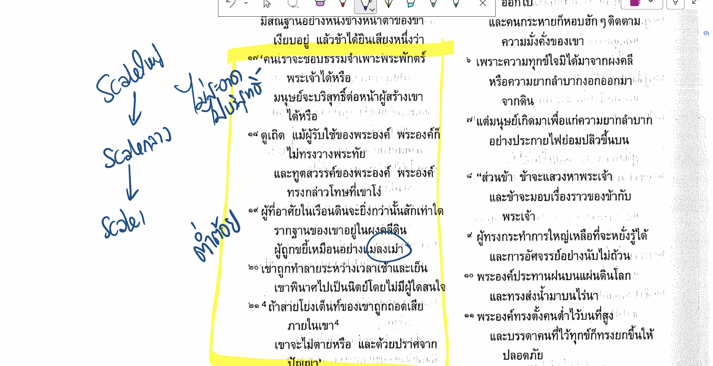
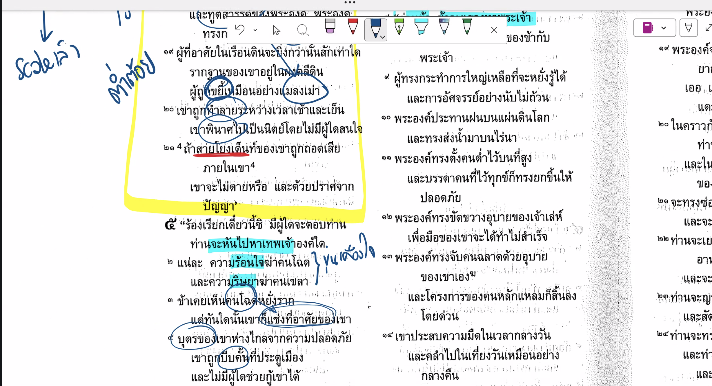
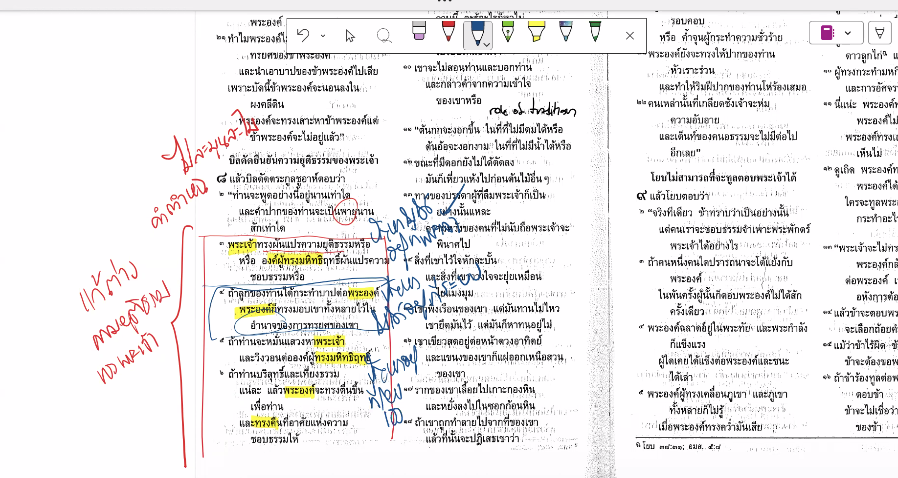
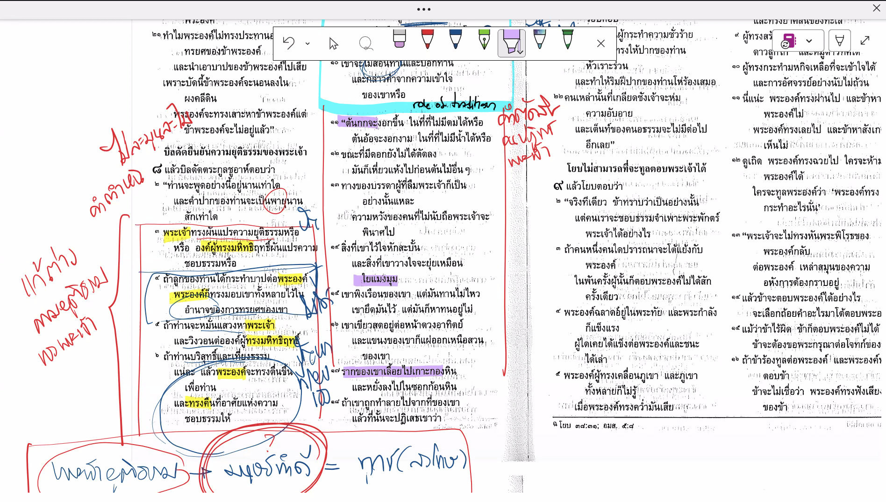

## สารบัญ
- [ภาพรวมวิดีโอ](#ภาพรวมวิดีโอ)
- [ประเด็นสำคัญของวิดีโอ](#ประเด็นสำคัญของวิดีโอ)
- [วิเคราะห์คำพูดของเอลีฟัสในโยบ 4-5](#วิเคราะห์คำพูดของเอลีฟัสในโยบ-4-5)
- [หลักการสำคัญของปัญญาเอลีฟัส](#หลักการสำคัญของปัญญาเอลีฟัส)
- [ภาพเปรียบเทียบสำคัญ](#ภาพเปรียบเทียบสำคัญ)

## ภาพรวมวิดีโอ

วิดีโอนี้เป็นตอนที่ 3 ของซีรีส์ศึกษา พระธรรมโยบ โดยทีมชูใจ ซึ่งเจาะลึกเรื่อง "สมการชีวิต" (0:00 - 1:48) ผ่านบทสนทนาระหว่างโยบและเพื่อนทั้ง 3 คน คือ เอลิฟัส, บิลดัด และ โศฟาร์ (0:00 - 9:20)

## ประเด็นสำคัญของวิดีโอ

สมการชีวิตที่ผิดเพี้ยน: (12:10)

ผู้คนในสมัยนั้น (รวมถึงเพื่อนของโยบ) เชื่อในสมการ: พระเจ้าผู้ยุติธรรม + เราทำดี = พระเจ้าต้องอวยพร
เมื่อโยบประสบหายนะ ทั้งที่เขาเป็นคนชอบธรรม สมการนี้จึงถูกเขย่า ทำให้เกิดความขัดแย้งในมุมมองระหว่างโยบและเพื่อนๆ (14:38 - 18:01)
มุมมองของเอลิฟัส: (20:30)

เอลิฟัส อ้างอิง กฎแห่งการกระทำ (หว่านอะไรก็เกี่ยวอย่างนั้น) และใช้ประสบการณ์รวมถึงภูมิปัญญาโบราณมาตัดสินว่า ความทุกข์ของโยบต้องเกิดจากความบาปที่ซ่อนอยู่ (21:20 - 23:38)
เขายืนยันว่าพระเจ้าไม่ผิด สมการไม่ผิด ดังนั้นคนที่ผิดต้องเป็นโยบ (28:01 - 31:00)
การเปิดโปงความเชื่อแบบตีกรอบ: (43:05 - 47:45)

วิดีโอนี้สะท้อนว่าบางครั้งเราก็ใช้ "กฎทั่วไป" มาตีกรอบการทำงานของพระเจ้า หากชีวิตไม่ราบรื่น เรามักจะสรุปทันทีว่าตนเองหรือคนอื่นทำผิดบาป ซึ่งพระธรรมโยบกำลังบอกว่านั่นไม่เป็นความจริงเสมอไป
สรุปบทเรียน:
เราไม่สามารถใช้ตรรกะแบบ "สาเหตุและผลลัพธ์" มาตัดสินทุกสิ่งที่พระเจ้าทำได้ ความเชื่อที่ตายตัวอาจกลายเป็นสิ่งที่ปิดกั้นการเข้าใจพระราชกิจที่เกินความเข้าใจของมนุษย์ (47:45 - 52:26)

วิดีโอนี้เป็นตอนที่ 4 ของซีรีส์ศึกษาพระธรรมโยบ ในหัวข้อ "เริ่มบทสนทนา" โดยเป็นการวิเคราะห์บทสนทนารอบแรกระหว่างโยบและเพื่อนทั้ง 3 คน (เอลิฟัส, บิลดัด และโสฟาร์) ซึ่งครอบคลุมเนื้อหาในพระธรรมโยบบทที่ 4-14

ประเด็นหลักของบทสนทนา
หัวใจสำคัญที่ทั้ง 3 คนพยายามสื่อสารกับโยบคือการหา "กติกาของชีวิต" ในโลกนี้ว่าพระเจ้าดำเนินงานอย่างไร ซึ่งสะท้อนมุมมองที่แตกต่างกันของเพื่อนแต่ละคน:

เอลิฟัส (09:49-15:36): เน้นว่าคนชอบธรรมจะไม่พินาศ ความทุกข์เป็นเหมือนการตีสอนจากพระเจ้าเพื่อพัฒนาชีวิต (คล้ายพระธรรมสุภาษิต) โดยเขาใช้ประสบการณ์ลี้ลับมาเป็นรากฐานความเชื่อ
บิลดัด (17:38-24:36): เน้นความถูกต้องชัดเจนแบบ "ขาวดำ" ว่าทำดีได้ดี ทำชั่วได้ชั่ว (กฎแห่งการกระทำ) และสรุปว่าลูกๆ ของโยบตายเพราะทำบาป ซึ่งเป็นการตัดสินที่รุนแรง
โสฟาร์ (28:50-33:42): เป็นคนที่พูดทิ่มแทงที่สุด โดยอ้างว่าตนเองเข้าใจน้ำพระทัยและสติปัญญาของพระเจ้า และตัดสินว่าโยบได้รับโทษน้อยกว่าที่ควรจะเป็นด้วยซ้ำ
บทสะท้อนและข้อคิด
ผู้ดำเนินรายการชี้ให้เห็นว่ามุมมองของเพื่อนโยบสะท้อนถึงความคิดในปัจจุบันที่มักจะ:

ลดทอนความซับซ้อนของชีวิต: ให้เหลือเพียงการทำดีเพื่อแลกกับพระพร (พระกิตติคุณแห่งความมั่งคั่ง)
ใช้ "กฎแห่งกรรม" หรือ "กฎแห่งการกระทำ": มาตัดสินคนอื่นที่กำลังเผชิญความทุกข์ ว่าต้องทำบาปหรือไม่มีความเชื่อถึงเกิดเรื่องร้าย (41:21-46:54)
การตีกรอบพระเจ้า: มนุษย์พยายามสร้างกรอบความคิดเกี่ยวกับพระเจ้าเพื่อให้รู้สึกมั่นคงและควบคุมได้ แทนที่จะวางใจในตัวพระองค์จริงๆ (47:05-51:17)
โยบในตอนตอบกลับเพื่อนๆ พยายามแย้งว่าเขาไม่ได้ทำผิด และความทุกข์ที่เกิดขึ้นนั้นไม่มีเหตุผลรองรับในเชิงตรรกะแบบที่เพื่อนพยายามยัดเยียดให้ เขาจึงเรียกร้องหาผู้กลางที่จะมาทำความเข้าใจกับพระเจ้าแทนเขา (34:10-36:35)

อะไรคือหลักการและแหล่งข้อมูลของหลักการ

4:1-11
4:12-21
5:1-16
5:17-26
5:27

พระธรรมโยบ บทที่ 4 และ 5 เป็น **สุนทรพจน์แรกของเอลีฟัส (Eliphaz)** ซึ่งเป็นเพื่อนคนแรกที่ลุกขึ้นมาพูดตอบโต้หลังจากโยบได้คร่ำครวญถึงความทุกข์ทรมานของตนเองในบทที่ 3

แก่นกลางในคำพูดของเอลีฟัสตั้งอยู่บนพื้นฐานของ **"ทฤษฎีแห่งการตอบแทน" (Retribution Theology)** ซึ่งเป็นกรอบความเชื่อหลักในยุคนั้นที่ว่า "ทำดีได้ดี ทำชั่วได้ชั่ว" พระเจ้าจะทรงอวยพรคนชอบธรรมและลงโทษคนบาปเสมอ

นี่คือการสังเกตเชิงลึกในแต่ละช่วงของพระคัมภีร์ที่คุณยกมาครับ

### 4:1-11: กฎแห่งการหว่านและการเก็บเกี่ยว (The Law of Retribution)

* **บริบท:** เอลีฟัสเริ่มต้นด้วยความเห็นอกเห็นใจ (ในระดับหนึ่ง) แต่ก็แฝงไปด้วยการตำหนิอย่างนุ่มนวล เขาเตือนความจำโยบว่า ในอดีตโยบเคยเป็นผู้ที่ให้คำปรึกษาและหนุนใจผู้ที่อ่อนแอ แต่เมื่อความทุกข์มาถึงตัว โยบกลับหมดกำลังใจและท้อแท้เสียเอง
* **การสังเกตเชิงลึก:** เอลีฟัสตั้งคำถามที่แทงใจดำว่า *"มีผู้บริสุทธิ์คนใดบ้างที่พินาศ?"* (ข้อ 7) เขากำลังใช้ตรรกะว่า คนที่ไถความบาปและหว่านความลำบากย่อมเก็บเกี่ยวสิ่งเหล่านั้น นี่เป็นการ **บอกใบ้ทางอ้อมว่าโยบจะต้องทำบาปอะไรซ่อนไว้แน่ๆ** พระเจ้าจึงทรงลงโทษเช่นนี้ เอลีฟัสใช้ประสบการณ์ส่วนตัว ("ตามที่ข้าเห็น" ในข้อ 8) มาเป็นตัวตัดสินสถานการณ์ของโยบ

### 4:12-21: นิมิตลี้ลับและความเปราะบางของมนุษย์ (Divine Transcendence & Human Frailty)

* **บริบท:** เอลีฟัสเปลี่ยนวิธีการจูงใจจากการใช้ตรรกะทั่วไป มาเป็นการอ้างสิทธิอำนาจเหนือธรรมชาติ โดยเล่าถึงประสบการณ์ลี้ลับที่เขาได้รับผ่านเสียงกระซิบในเวลากลางคืน
* **การสังเกตเชิงลึก:** ใจความสำคัญของนิมิตนี้คือ **"มนุษย์ตายตายจะชอบธรรมกว่าพระเจ้าได้หรือ?"** (ข้อ 17) เอลีฟัสเน้นย้ำถึงระยะห่างระหว่างพระเจ้าผู้ยิ่งใหญ่กับมนุษย์ที่เป็นเพียง "บ้านดินเหนียว" (เปราะบางและแตกสลายง่าย) แม้แต่ทูตสวรรค์พระเจ้ายังพบความผิดพลาดได้ นับประสาอะไรกับมนุษย์ การยกเรื่องนี้มาพูดเพื่อเป็นการเตือนสติโยบว่า อย่าคิดว่าตัวเองชอบธรรมจนถึงขั้นกล้าตัดพ้อหรือตั้งคำถามกับพระเจ้า

### 5:1-16: ชะตากรรมของคนโง่เขลาและความยุติธรรมของพระเจ้า (The Fate of the Foolish & God's Sovereign Justice)

* **บริบท:** เอลีฟัสเตือนโยบถึงอันตรายของความโกรธและความขุ่นเคืองใจ พร้อมทั้งแนะนำให้โยบหันไปหาพระเจ้า
* **การสังเกตเชิงลึก:** เอลีฟัสชี้ให้เห็นว่า "ความโกรธฆ่าคนโง่" (ข้อ 2) ซึ่งเป็นการเตือนโยบว่าการบ่นคร่ำครวญแบบในบทที่ 3 เป็นพฤติกรรมของคนโง่เขลา จากนั้นเขาได้บรรยายถึงความยิ่งใหญ่ของพระเจ้า ผู้ทรงกระทำกิจการที่ไม่อาจหยั่งรู้ได้ (ข้อ 9) เช่น การประทานฝน การขัดขวางคนเจ้าเล่ห์ และการช่วยกู้คนขัดสน เอลีฟัสกำลังบอกให้โยบ **เลิกบ่นและมอบคดีความของตนไว้กับพระเจ้าผู้ทรงยุติธรรม**

### 5:17-26: พระพรแห่งการตีสอน (The Blessing of Divine Discipline)

* **บริบท:** ช่วงนี้คือจุดเปลี่ยนจากคำเตือนมาเป็นการให้ความหวัง เอลีฟัสมองความทุกข์ในมุมมองของการขัดเกลา
* **การสังเกตเชิงลึก:** เอลีฟัสนำเสนอแนวคิดว่า ความทุกข์ที่โยบเผชิญนั้นเป็น **"การตีสอนจากองค์ผู้ทรงมหิทธิฤทธิ์"** (ข้อ 17) และคนที่ถูกพระเจ้าตีสอนนั้นย่อมเป็นสุข เพราะพระองค์ทรงทำให้เกิดบาดแผล แต่พระองค์ก็ทรงพันผูกให้ เอลีฟัสสัญญาว่าหากโยบยอมถ่อมใจรับการตีสอนและกลับใจ พระเจ้าจะทรงฟื้นฟูเขา ปกป้องเขาจากภัยพิบัติ (ความอดอยาก, สงคราม, สัตว์ร้าย) และให้เขามีชีวิตที่ยืนยาวและบริบูรณ์

### 5:27: บทสรุปที่เปี่ยมด้วยความมั่นใจ (The Confident Conclusion)

* **บริบท:** ข้อนี้คือบทสรุปปิดท้ายสุนทรพจน์ของเอลีฟัส
* **การสังเกตเชิงลึก:** *"ดูเถิด เราได้ค้นคว้าเรื่องนี้แล้ว และก็เป็นความจริงตามนั้น จงฟัง และรับรู้เพื่อประโยชน์ของท่านเองเถิด"* ประโยคนี้แสดงให้เห็นถึง **ความมั่นใจอย่างสูงสุดในภูมิปัญญาของตนเองและกลุ่มของตน** เอลีฟัสเชื่อว่าสิ่งที่เขาพูดคือความจริงแท้ที่ผ่านการพิสูจน์มาแล้ว เขาปิดโอกาสที่จะรับฟังคำอธิบายของโยบ และบีบบังคับให้โยบต้องยอมรับกรอบความคิดนี้แต่เพียงผู้เดียว

---

**สรุปภาพรวมคำพูดของเอลีฟัส:**
คำพูดของเอลีฟัสในบทที่ 4 และ 5 เต็มไปด้วย **"ความจริงทางศาสนาที่ถูกต้องในเชิงหลักการ"** (เช่น พระเจ้าทรงยุติธรรม, มนุษย์อ่อนแอ, การตีสอนของพระเจ้าเป็นสิ่งดี) แต่ปัญหาที่ยิ่งใหญ่ที่สุดคือ **เขาประยุกต์ใช้ความจริงเหล่านั้นผิดคนและผิดสถานการณ์** เพราะในความเป็นจริง (ดังที่ปรากฏในบทที่ 1 และ 2) โยบไม่ได้ทนทุกข์เพราะเขาทำบาป แต่เป็นเพราะความเชื่อฟังและความชอบธรรมของเขาต่างหาก บทสนทนานี้จึงเป็นตัวอย่างชั้นดีของการใช้หลักข้อเชื่อที่ถูกต้องอย่างปราศจากความเข้าใจและความเห็นอกเห็นใจบริบทของผู้รับฟัง

หลักการสำคัญที่เป็นแก่นกลางใน **"ปัญญา"** ของเอลีฟัส ซึ่งเขานำเสนอเพื่ออธิบายและพยายามแก้ปัญหาความทุกข์ทรมานของโยบ สามารถสรุปออกมาเป็น 4 หลักการหลัก ดังนี้ครับ

## 1. หลักการแห่งการหว่านและการเก็บเกี่ยว (The Principle of Retribution)

นี่คือเลนส์หลักที่เอลีฟัสใช้มองโลก เขาเชื่อมั่นใน "ทฤษฎีการตอบแทน" หรือกฎแห่งเหตุและผลอย่างเคร่งครัด

* **แนวคิด:** โลกนี้ทำงานภายใต้กฎเกณฑ์ทางศีลธรรมที่แน่นอน คือ **ทำดีได้ดี ทำชั่วได้ชั่ว** พระเจ้าจะทรงอวยพรคนชอบธรรมและลงโทษคนบาป
* **สิ่งที่เขานำเสนอต่อโยบ:** เขาเชื่อว่าความทุกข์ที่รุนแรงย่อมมาจากความบาปที่รุนแรง เขาจึงบอกโยบกลายๆ ว่า "คนที่หว่านความชั่วก็ต้องเก็บเกี่ยวความพินาศ" (4:8) ในปัญญาของเอลีฟัส **ไม่มีพื้นที่สำหรับคนชอบธรรมที่ต้องทนทุกข์อย่างแสนสาหัสโดยไม่มีสาเหตุ** หากโยบเจอเรื่องแย่ขนาดนี้ แปลว่าโยบต้องมีความผิดบาปบางอย่างซ่อนอยู่อย่างแน่นอน

## 2. หลักการเรื่องความบริสุทธิ์ของพระเจ้า (The Principle of God's Absolute Holiness)

เอลีฟัสยกย่องพระเจ้าในฐานะผู้ทรงสูงส่งและบริสุทธิ์เหนือสรรพสิ่ง ซึ่งนำไปสู่ข้อสรุปเกี่ยวกับมนุษย์

* **แนวคิด:** พระเจ้าทรงบริสุทธิ์และยิ่งใหญ่มากจนแม้แต่ทูตสวรรค์ก็ยังมีข้อบกพร่องในสายพระเนตรของพระองค์ แล้วมนุษย์ซึ่งเป็นแค่ "บ้านดินเหนียว" จะอ้างว่าตนเองชอบธรรมได้อย่างไร (4:17-19)
* **สิ่งที่เขานำเสนอต่อโยบ:** เอลีฟัสใช้หลักการนี้เพื่อเตือนโยบว่า อย่าคิดว่าตัวเองสมบูรณ์แบบจนกล้าเรียกร้องความยุติธรรมหรือตัดพ้อพระเจ้า มนุษย์ทุกคนล้วนมีความบาป ดังนั้นการที่โยบถูกลงโทษจึงไม่ใช่เรื่องแปลก และโยบไม่มีสิทธิ์ที่จะบอกว่าตนเองไร้ความผิด

## 3. หลักการเรื่องความทุกข์คือการตีสอน (The Principle of Divine Discipline)

เอลีฟัสนำเสนอมุมมองด้านบวก (ในแบบของเขา) เกี่ยวกับความทุกข์ เพื่อให้ความหวังแก่โยบ

* **แนวคิด:** ความทุกข์ไม่จำเป็นต้องเป็นความพินาศเสมอไป แต่อาจเป็น **"การตีสอน" (Discipline)** จากพระเจ้าที่กระทำต่อผู้ที่พระองค์ทรงรัก เพื่อให้เขารู้ตัวและกลับใจ
* **สิ่งที่เขานำเสนอต่อโยบ:** เขากระตุ้นให้โยบมองความทุกข์เป็นการตักเตือนสอนใจ (5:17) เอลีฟัสพยายามปลอบโยบว่า หากโยบยอมรับการตีสอน ถ่อมใจลง และอธิษฐานสารภาพบาปต่อพระเจ้า พระเจ้าผู้ทรงทำให้เกิดบาดแผล ก็จะทรงเป็นผู้รักษาและฟื้นฟูชีวิตของโยบให้กลับมาเจริญรุ่งเรืองอีกครั้ง

## 4. ปัญญาที่อ้างอิงจากประสบการณ์และนิมิต (Authority from Experience and Mysticism)

ปัญญาของเอลีฟัสไม่ได้มาจากการคาดเดาลอยๆ แต่เขามั่นใจในหลักการของเขาเพราะมันมีแหล่งอ้างอิง

* **แนวคิด:** เขาอาศัย **การสังเกตจากประสบการณ์ชีวิต** ("ตามที่ข้าเห็น" - 4:8) และ **นิมิตลี้ลับส่วนตัว** (เสียงกระซิบและนิมิตในยามค่ำคืน - 4:12-16) เป็นเครื่องยืนยันความรู้ของเขา
* **สิ่งที่เขานำเสนอต่อโยบ:** เอลีฟัสปิดท้ายด้วยความมั่นใจสูงสุดว่า *"เราได้ค้นคว้าเรื่องนี้แล้ว และก็เป็นความจริงตามนั้น"* (5:27) เขาเชื่อว่าปัญญาที่มาจากผู้ใหญ่ที่อาบน้ำร้อนมาก่อนและได้รับการสำแดงจากสวรรค์ เป็นสิ่งที่ถูกต้องที่สุด โยบมีหน้าที่แค่ต้อง "ฟังและรับรู้" เท่านั้น

---

**จุดบอดใน "ปัญญา" ของเอลีฟัส**
ปัญหาของเอลีฟัสไม่ได้อยู่ที่หลักการของเขาผิด (ในพระคัมภีร์หลายตอน หลักการเหล่านี้เป็นความจริง) แต่อยู่ที่ **ความแข็งกระด้างและการนำไปใช้ผิดสถานการณ์**

ปัญญาของเอลีฟัสเป็นเหมือน **"สูตรสำเร็จ" (Formulaic Wisdom)** ที่ตีกรอบการกระทำของพระเจ้าไว้แค่มิติเดียว เขาไม่ยอมรับว่าบนโลกนี้มีความซับซ้อนที่เหนือความเข้าใจของมนุษย์ เช่น โยบไม่ได้ทนทุกข์เพราะทำบาป หรือถูกตีสอน แต่ทนทุกข์เพราะเป็นสนามทดสอบความเชื่อตามพระประสงค์ของพระเจ้า (ซึ่งเอลีฟัสไม่รู้เหตุการณ์เบื้องหลังในสวรรค์เลย) การนำความจริงที่ถูกต้องไปยัดเยียดให้คนกำลังเจ็บปวดโดยปราศจากการรับฟัง ปัญญาของเขาจึงกลายเป็นการซ้ำเติมมากกว่าการเยียวยาครับ

เอลีฟัสเป็นนักพูดเชิงกวีที่ใช้ **"ภาพเปรียบเปรย" (Imagery)** ได้อย่างทรงพลังและเห็นภาพชัดเจน ภาพที่เขาใช้สะท้อนให้เห็นบริบทของสังคมเกษตรกรรม วิถีชีวิตคนเร่ร่อน และธรรมชาติในยุคโบราณ โดยเขานำภาพเหล่านี้มาอธิบายหลักการของเขาดังนี้ครับ

### 1. ภาพการไถและการหว่าน (ภาพเกษตรกรรม)

* **พระคัมภีร์:** โยบ 4:8 *"ตามที่ข้าเห็น คนที่ไถความพินาศ และหว่านความลำบาก ก็เก็บเกี่ยวสิ่งเหล่านั้น"*
* **ความหมาย:** เอลีฟัสใช้ภาพพื้นฐานของการเกษตรมาอธิบาย **ทฤษฎีการตอบแทน** สิ่งที่คุณทำ (หว่าน) คือสิ่งที่คุณจะได้รับ (เก็บเกี่ยว) เขาพยายามบอกว่าความทุกข์ของโยบคือผลผลิตจากเมล็ดพันธุ์แห่งความบาปที่โยบเคยหว่านเอาไว้

### 2. ภาพสิงโตที่ถูกหักเขี้ยว (ภาพสัตว์ป่า)

* **พระคัมภีร์:** โยบ 4:10-11 *"เสียงคำรามของสิงโต... ฟันของสิงโตหนุ่มก็หัก สิงโตแก่พินาศไปเพราะไม่มีเหยื่อ"*
* **ความหมาย:** เขาเปรียบเทียบคนชั่วร้ายที่มีอำนาจและชอบข่มเหงผู้อื่นเหมือน "สิงโตที่ดุร้าย" แม้จะดูน่าเกรงขามและแข็งแกร่งเพียงใด แต่ท้ายที่สุดพระเจ้าก็จะทรงยุติอำนาจนั้น (หักฟัน) และทำให้พวกเขาพินาศไป ภาพนี้ใช้อธิบายว่าคนอธรรมย่อมไม่รอดพ้นการพิพากษา

### 3. ภาพบ้านดินเหนียวและตัวมอด (ภาพสิ่งก่อสร้างและแมลง)

* **พระคัมภีร์:** โยบ 4:19 *"นับประสาอะไรกับคนที่อาศัยอยู่ในเรือนดินเหนียว ผู้ซึ่งรากฐานของเขาอยู่ในผงคลีดิน ผู้ถูกบี้แบนเหมือนตัวมอด"*
* **ความหมาย:** ภาพนี้เน้นย้ำถึง **ความเปราะบางและไร้ค่าของมนุษย์** เมื่อเทียบกับความบริสุทธิ์ยิ่งใหญ่ของพระเจ้า "เรือนดินเหนียว" หรือ "ผงคลีดิน" สื่อถึงร่างกายมนุษย์ที่เสื่อมสลายได้ง่าย และมนุษย์นั้นอ่อนแอจนสามารถถูกทำลายได้ง่ายดายเหมือนเอาปลายนิ้วบี้ตัวมอด (หรือแมลงตัวเล็กๆ)

### 4. ภาพเชือกเต็นท์ที่ถูกถอน (ภาพวิถีชีวิตคนเร่ร่อน)

* **พระคัมภีร์:** โยบ 4:21 *"เชือกเต็นท์ของเขาถูกถอนออกไปจากเขาไม่ใช่หรือ? เขาตายไปโดยปราศจากปัญญา"*
* **ความหมาย:** ในวัฒนธรรมที่อาศัยอยู่ในเต็นท์ หาก "เชือกเต็นท์" ถูกดึงออก เต็นท์ทั้งหลังก็จะพังทลายลงมาทันที เอลีฟัสใช้ภาพนี้เปรียบเปรยถึง **ความตายที่มาถึงอย่างกะทันหัน** และชีวิตที่พังทลายลงของคนที่ขาดปัญญา (คนที่ไม่ยอมรับฟังการตักเตือน)

### 5. ภาพประกายไฟที่ปลิวขึ้นบนฟ้า (ภาพปรากฏการณ์ธรรมชาติ)

* **พระคัมภีร์:** โยบ 5:7 *"แต่มนุษย์เกิดมาเพื่อความทุกข์ลำบาก อย่างประกายไฟที่ปลิวขึ้นเบื้องบน"*
* **ความหมาย:** ประกายไฟจากกองไฟย่อมลอยขึ้นสู่เบื้องบนเสมอตามกฎธรรมชาติ เอลีฟัสเปรียบสิ่งนี้กับมนุษย์ว่า **ความทุกข์เป็นของคู่กับมนุษย์คนบาป** เป็นสิ่งที่หลีกเลี่ยงไม่ได้และเกิดขึ้นตามธรรมชาติเช่นเดียวกับทิศทางของประกายไฟ

### 6. ภาพการทำแผลของแพทย์ (ภาพทางการแพทย์)

* **พระคัมภีร์:** โยบ 5:18 *"เพราะพระองค์ทรงทำให้เกิดบาดแผล แต่ก็ทรงพันผูกให้ พระองค์ทรงตีให้ช้ำ แต่พระหัตถ์ของพระองค์ทรงรักษาให้หาย"*
* **ความหมาย:** เอลีฟัสใช้ภาพนี้เพื่ออธิบาย **พระพรแห่งการตีสอน** พระเจ้าไม่ได้ทำร้ายเพื่อให้พินาศ แต่บาดแผลนั้นเหมือนการผ่าตัดรักษาโรค หากยอมรับการตีสอน ท้ายที่สุดพระเจ้าผู้ทรงลงแส้ จะเป็นผู้พันแผลและเยียวยาให้กลับมาสมบูรณ์

### 7. ภาพฟ่อนข้าวที่สุกงอม (ภาพการเก็บเกี่ยว)

* **พระคัมภีร์:** โยบ 5:26 *"ท่านจะเข้าสู่อุโมงค์ฝังศพเมื่อแก่หง่อม เหมือนฟ่อนข้าวที่เขาเอาขึ้นลานตามฤดูกาล"*
* **ความหมาย:** นี่คือบทสรุปแห่งความหวังที่เอลีฟัสหยิบยื่นให้โยบ เขาเปรียบชีวิตของคนชอบธรรมที่ผ่านการขัดเกลาแล้วว่า จะไม่ตายก่อนวัยอันควร แต่จะมีชีวิตยืนยาว บริบูรณ์ และจบลงอย่างสวยงามเหมือน **ฟ่อนข้าวที่สุกเต็มที่และถูกเก็บเกี่ยวในเวลาที่เหมาะสมที่สุด**

การที่เอลีฟัสเลือกใช้ภาพเปรียบเปรย (Metaphors) เหล่านี้ ไม่ได้เป็นเพียงแค่ความสละสลวยทางบทกวีเท่านั้น แต่เป็น **กลยุทธ์ทางวาทศิลป์ (Rhetorical Strategy)** ที่แยบยลมากในยุคโบราณ เหตุผลหลักที่เขาต้องใช้ภาพเหล่านี้อธิบาย มีดังนี้ครับ

### 1. เชื่อมโยงกับวิถีชีวิตและวัฒนธรรม (Cultural Relatability)

ในยุคตะวันออกใกล้โบราณ (Ancient Near East) ผู้คนใช้ชีวิตอยู่กับเกษตรกรรม การเลี้ยงสัตว์ และการเดินทางรอนแรมในเต็นท์

* แนวคิดเรื่องความยุติธรรมของพระเจ้าเป็นนามธรรมที่เข้าใจยาก เอลีฟัสจึงดึงลงมาให้จับต้องได้ผ่าน **สิ่งที่ทุกคนเห็นอยู่ทุกวัน**
* เมื่อเขาพูดถึงการไถหว่าน สิงโตล่าเหยื่อ หรือการดึงเชือกเต็นท์ โยบและคนที่นั่งฟังอยู่จะเข้าใจความหมายและ "เห็นภาพ" ทันทีโดยไม่ต้องตีความซับซ้อน

### 2. ทำให้กฎของพระเจ้าดูเป็น "กฎธรรมชาติ" ที่เถียงไม่ได้ (Appealing to Natural Laws)

นี่คือเทคนิคที่ฉลาดมากของเอลีฟัส เขาพยายามทำให้ "ทฤษฎีการตอบแทน" (ทำดีได้ดี ทำชั่วได้ชั่ว) ดูเป็นความจริงที่หลีกเลี่ยงไม่ได้พอๆ กับกฎเกณฑ์ของธรรมชาติ

* ใครบ้างจะเถียงได้ว่า ปลูกข้าวสาลีแล้วจะไม่ออกมาเป็นข้าวสาลี? (การหว่านและการเก็บเกี่ยว)
* ใครบ้างจะเถียงได้ว่า ประกายไฟจะไม่ลอยขึ้นฟ้า? (ประกายไฟปลิวขึ้นเบื้องบน)
* เอลีฟัสกำลังสื่อว่า: **"ธรรมชาติทำงานอย่างเป็นเหตุเป็นผลฉันใด การพิพากษาของพระเจ้าก็เป็นเหตุเป็นผลฉันนั้น"** เขาใช้ภาพเหล่านี้ปิดประตูไม่ให้โยบโต้แย้งได้เลย

### 3. เป็นการตำหนิทางอ้อม แต่แทงใจลึก (Indirect Accusation)

เอลีฟัสเป็นผู้ใหญ่และเป็นเพื่อน การชี้หน้าด่าตรงๆ ว่า *"โยบ ท่านต้องแอบทำบาปชั่วร้ายแน่ๆ พระเจ้าถึงลงโทษท่านแบบนี้!"* อาจดูรุนแรงเกินไปและทำให้โยบต่อต้านทันที

* เขาจึงใช้ภาพ **"คนที่ไถความพินาศก็ย่อมเก็บเกี่ยวสิ่งนั้น"** เพื่อให้โยบคิดตามและประเมินตัวเอง
* มันเป็นวิธีวิจารณ์แบบรักษาหน้า (Passive-aggressive) แต่พุ่งเป้าไปที่บาดแผลในใจของโยบอย่างแม่นยำ

### 4. เพื่อข่มให้เห็นถึงความเปราะบางของมนุษย์ (Emphasizing Human Frailty)

โยบกำลังคร่ำครวญและตั้งคำถามกับสวรรค์ เอลีฟัสต้องการเบรกความกล้าของโยบ โดยการเน้นย้ำว่ามนุษย์นั้นต่ำต้อยแค่ไหนเมื่อเทียบกับพระเจ้า

* เขาไม่ได้บอกแค่ว่ามนุษย์อ่อนแอ แต่เปรียบกับ **"ตัวมอด"** (ถูกบี้ให้ตายเมื่อไหร่ก็ได้) หรือ **"บ้านดินเหนียว"** (โดนน้ำเซาะก็พัง) หรือ **"เต็นท์ที่ถูกดึงเชือก"** (พังครืนลงมาในพริบตา)
* ภาพเหล่านี้บีบให้โยบ (และผู้อ่าน) รู้สึกถึงความไร้ค่าและไร้ความมั่นคง เพื่อดึงให้โยบเลิกตั้งคำถามและหันมาถ่อมใจยอมรับสภาพ

### 5. สร้างภาพความหวังที่เป็นรูปธรรมให้ยึดเหนี่ยว (Visualizing Restoration)

ในตอนท้าย เมื่อเอลีฟัสต้องการโน้มน้าวให้โยบกลับใจ เขาเปลี่ยนจากภาพที่น่ากลัวมาเป็นภาพที่อบอุ่นและมีชีวิตชีวา

* ภาพ **"การทำแผลของแพทย์"** สื่อถึงความอ่อนโยนและการเยียวยา
* ภาพ **"ฟ่อนข้าวที่สุกงอมตามฤดูกาล"** สื่อถึงบั้นปลายชีวิตที่สมบูรณ์ พรั่งพร้อม และสง่างาม
* เขาใช้ภาพที่สวยงามเหล่านี้เป็นเสมือน "แครอท" ที่มาล่อใจให้โยบยอมรับสารภาพบาป (ที่โยบไม่ได้ทำ) เพื่อจะได้รับชีวิตที่งดงามแบบในภาพนี้กลับคืนมา

**สรุปก็คือ:** เอลีฟัสใช้ภาพเหล่านี้เพื่อ **เปลี่ยนเรื่องศาสนาที่เข้าใจยากให้กลายเป็นเรื่องใกล้ตัว ทำให้การตำหนิดูนุ่มนวลแต่ลึกซึ้ง และทำให้ตรรกะของเขาดูเป็นความจริงสากลที่ใครก็ไม่อาจปฏิเสธได้** ครับ

แหล่งที่มาของ **"ปัญญา"** หรือหลักการที่เอลีฟัสนำมาใช้อบรมและตัดสินโยบในบทที่ 4 และ 5 นั้น ไม่ได้เกิดขึ้นจากการคาดเดาลอยๆ แต่มาจาก **3 แหล่งหลัก** ซึ่งทำให้เขามีความมั่นใจในคำพูดของตนเองอย่างมาก ดังนี้ครับ:

### 1. ประสบการณ์ส่วนตัวและการสังเกต (Personal Experience & Observation)

แหล่งปัญญาแรกของเอลีฟัสคือสิ่งที่เขาเห็นและเรียนรู้จากการใช้ชีวิต เขาเป็นคนที่เชื่อในหลักฐานเชิงประจักษ์ (Empirical Evidence)

* **ข้อพระคัมภีร์อ้างอิง:** โยบ 4:8 *"**ตามที่ข้าเห็น** คนที่ไถความพินาศ และหว่านความลำบาก ก็เก็บเกี่ยวสิ่งเหล่านั้น"*
* **ความหมาย:** เอลีฟัสสังเกตโลกและสังคมรอบตัวมานาน เขาเห็นวัฏจักรของคนที่ทำชั่วแล้วได้รับผลกรรม (ทฤษฎีการตอบแทน) เขาจึงยึดเอา "ประสบการณ์ที่เขาเคยเห็น" มาเป็นตั้งเป็นกฎเกณฑ์สากล และใช้มันมาเป็นมาตรวัดชีวิตของโยบ

### 2. นิมิตลี้ลับและประสบการณ์เหนือธรรมชาติ (Mystical Vision & Revelation)

นี่คือแหล่งปัญญาที่เอลีฟัสใช้เพื่อสร้าง **"สิทธิอำนาจจากเบื้องบน"** ให้กับคำพูดของตนเอง เพื่อให้โยบไม่กล้าโต้แย้ง

* **ข้อพระคัมภีร์อ้างอิง:** โยบ 4:12-16 *"มีคำกระซิบมาถึงข้า... เมื่อวิญญาณผ่านหน้าข้าไป... มีความเงียบ แล้วข้าได้ยินเสียงหนึ่งว่า..."*
* **ความหมาย:** เอลีฟัสอ้างถึงประสบการณ์ทางจิตวิญญาณในเวลากลางคืนที่มีวิญญาณมากระซิบความล้ำลึกกับเขา (เรื่องที่ว่ามนุษย์จะชอบธรรมกว่าพระเจ้าไม่ได้) การอ้างแหล่งที่มาแบบนี้ เป็นกลยุทธ์ที่ทำให้หลักการของเขาดูศักดิ์สิทธิ์และมาจากสวรรค์โดยตรง ทำให้ผู้ฟังรู้สึกเกรงกลัวและต้องยอมจำนน

### 3. ภูมิปัญญาสืบทอดและการศึกษาค้นคว้าของกลุ่ม (Tradition & Collective Investigation)

ปัญญาของเอลีฟัสไม่ใช่ความคิดเห็นส่วนตัวที่คิดขึ้นมาคนเดียว แต่เป็น **"ฉันทามติ"** หรือความเชื่อหลักของคนในยุคนั้น (โดยเฉพาะกลุ่มคนเฒ่าคนแก่และนักปราชญ์)

* **ข้อพระคัมภีร์อ้างอิง:** โยบ 5:27 *"ดูเถิด **เราได้ค้นคว้าเรื่องนี้แล้ว** และก็เป็นความจริงตามนั้น จงฟัง และรับรู้เพื่อประโยชน์ของท่านเองเถิด"*
* **ความหมาย:** คำว่า "เรา" (We) แสดงให้เห็นว่าหลักการนี้ผ่านการถกเถียง สังเคราะห์ และสรุปผลมาแล้วโดยกลุ่มผู้มีปัญญา เป็นเหมือนหลักเทววิทยาที่สืบทอดกันมา (Orthodoxy) เขาจึงมั่นใจร้อยเปอร์เซ็นต์ว่านี่คือความจริงแท้ที่ผ่านการพิสูจน์แล้ว

---

**สรุป:**
แหล่งปัญญาของเอลีฟัสคือการผสมผสานระหว่าง **"สิ่งที่ตาเห็น (ประสบการณ์) + สิ่งที่จิตสัมผัส (นิมิต) + สิ่งที่สังคมยอมรับ (ประเพณีและภูมิปัญญากลุ่ม)"**

ด้วยแหล่งที่มาทั้งสามนี้ จึงไม่แปลกที่เอลีฟัสจะเชื่อมั่นในตัวเองอย่างเต็มเปี่ยม แต่จุดบอดที่ร้ายแรงที่สุดของเขาคือ **แหล่งปัญญาทั้ง 3 อย่างนี้ ถูกจำกัดอยู่แค่ใน "โลกมนุษย์"** เขาไม่มีทางรู้เลยว่ามี "การประชุมในสวรรค์" ระหว่างพระเจ้ากับซาตาน (ในบทที่ 1-2) เกิดขึ้น ปัญญาของมนุษย์แม้จะดูสมบูรณ์แบบแค่ไหน ก็ไม่อาจหยั่งรู้แผนการที่แท้จริงของพระเจ้าได้ทั้งหมดครับ

เป็นข้อสังเกตที่เฉียบคมมากครับ! การใช้ภาพจาก **"มหภาคลงไปสู่จุลภาค" (Macro to Micro)** เป็นเทคนิคทางวรรณศิลป์ที่เอลีฟัสใช้อย่างจงใจเพื่อบีบให้โยบ (และผู้อ่าน) รู้สึกถึงความเล็กกระจ้อยร่อยของมนุษย์เมื่ออยู่ต่อหน้าความยิ่งใหญ่ของพระเจ้า

จุดที่เอลีฟัสใช้ภาพ "จากใหญ่ไปเล็ก" ได้อย่างชัดเจนและทรงพลังที่สุด ปรากฏใน 2 ช่วงหลัก ดังนี้ครับ

### 1. จากความยิ่งใหญ่แห่งสวรรค์ สู่แมลงตัวเล็กๆ (โยบ 4:17-19)

นี่คือจุดที่ชัดเจนที่สุดของการซูมภาพจากระดับจักรวาลลงมาสู่จุดที่เล็กที่สุด เพื่อเปรียบเทียบสถานะของมนุษย์กับพระเจ้า เอลีฟัสไล่ระดับภาพดังนี้:

* **ระดับภาพใหญ่ที่สุด (สวรรค์/องค์พระผู้เป็นเจ้า):** เขาเริ่มจากคำถามที่ว่ามนุษย์จะชอบธรรมกว่า "พระเจ้า" ได้หรือ (ข้อ 17) ซึ่งพระองค์คือจุดสูงสุดแห่งความสมบูรณ์แบบ
* **ระดับภาพรองลงมา (ทูตสวรรค์):** เขาซูมลงมาที่ผู้รับใช้ในสวรรค์ แม้แต่ "ทูตสวรรค์" ที่ว่าบริสุทธิ์ พระเจ้าก็ยังทรงพบข้อบกพร่อง (ข้อ 18)
* **ระดับภาพเล็ก (มนุษย์/วัตถุ):** เขาซูมลงมาที่โลกมนุษย์ โดยเปรียบมนุษย์เป็นเพียง "เรือนดินเหนียว" (ข้อ 19) ซึ่งเป็นสิ่งก่อสร้างที่เปราะบางที่สุดในยุคนั้น โดนน้ำเซาะก็พังทลาย
* **ระดับภาพเล็กจิ๋ว (ฝุ่นและแมลง):** ท้ายที่สุด เขาตีค่ารากฐานของมนุษย์ว่าเป็นแค่ "ผงคลีดิน" และอ่อนแอจนสามารถถูกบี้ให้แบนได้เหมือน **"ตัวมอด"** (แมลงตัวเล็กๆ)

**จุดประสงค์:** การดึงภาพจากพระเจ้าที่ยิ่งใหญ่ลงมาจบที่ "ตัวมอด" เป็นการกดสเกลความเย่อหยิ่งของมนุษย์ให้ราบคาบ เอลีฟัสกำลังบอกโยบว่า *"เมื่อเทียบกับสวรรค์แล้ว ท่านก็เป็นแค่แมลงตัวเล็กๆ ที่ถูกบี้ให้ตายเมื่อไหร่ก็ได้ ท่านมีสิทธิ์อะไรไปเรียกร้องความยุติธรรมจากพระเจ้า?"*

---

### 2. จากระดับปรากฏการณ์โลก สู่รายละเอียดชีวิตบุคคล (โยบ 5:9-16)

ในบทที่ 5 เอลีฟัสใช้วิธีซูมภาพจากกิจการที่ยิ่งใหญ่ของพระเจ้าในระดับธรรมชาติ ลงมาสู่การแทรกแซงในระดับบุคคล เพื่ออธิบายว่าพระเจ้าทรงครอบครองทุกสิ่ง:

* **ระดับภาพใหญ่ (จักรวาลและธรรมชาติ):** เอลีฟัสบรรยายว่าพระเจ้าทรงกระทำ "การใหญ่สุดหยั่งรู้" และ "การมหัศจรรย์นับไม่ถ้วน" (ข้อ 9) โดยยกตัวอย่างที่ยิ่งใหญ่ที่สุดคือ การที่พระองค์ทรง "ประทานฝนลงบนพื้นพิภพ" (ข้อ 10) ซึ่งเป็นภาพกว้างระดับโลก (Global scale)
* **ระดับภาพกลาง (สังคมและมนุษย์):** เขาซูมลงมาที่สังคมมนุษย์ ว่าพระเจ้าทรงสามารถยกคนต่ำต้อยให้สูงขึ้น และทำให้แผนการของ "คนเจ้าเล่ห์" พังทลายลง (ข้อ 11-12)
* **ระดับภาพเล็ก (รายละเอียดรายบุคคล):** ท้ายที่สุด เขาซูมเข้าไปที่อวัยวะและการกระทำเฉพาะจุด คือการที่พระเจ้าทรงช่วยกู้คนขัดสนให้พ้นจาก **"ดาบแห่งปากของพวกเขา"** (ข้อ 15) ซึ่งหมายถึงคำพูดใส่ร้ายป้ายสี

**จุดประสงค์:** เอลีฟัสต้องการสื่อว่า พระเจ้าผู้ทรงควบคุมฝนที่ตกลงมาคลุมทั้งโลก (ภาพใหญ่) ก็ทรงเป็นพระเจ้าองค์เดียวกันที่ใส่ใจและมองเห็นคำพูดโกหกที่ออกมาจากปากคนคนหนึ่ง (ภาพเล็ก) ดังนั้น การพิพากษาและการตีสอนของพระองค์จึงแม่นยำและไม่มีใครหลบซ่อนได้

---

### ทำไมเอลีฟัสต้องใช้เทคนิค "ใหญ่ไปเล็ก"?

การซูมภาพแบบนี้ (Zooming in) เป็นจิตวิทยาในการโน้มน้าวใจอย่างหนึ่ง เมื่อผู้ฟังถูกพาให้มองเห็นภาพรวมที่ยิ่งใหญ่ตระการตา (เช่น สวรรค์ หรือ ธรรมชาติ) พวกเขาจะรู้สึกถึงความเล็กลงของตนเองโดยอัตโนมัติ

เมื่ออีลีฟัสดึงภาพลงมาถึงจุดที่เล็กที่สุด (ตัวมอด, ปากที่พูดจาใส่ร้าย) มันทำให้โยบถูกต้อนให้จนมุมทางความคิด ว่าตนเองเป็นเพียงเศษเสี้ยวเล็กๆ ในจักรวาลของพระเจ้า และทางเดียวที่เศษเสี้ยวนี้จะอยู่รอดได้ คือต้องยอมจำนนและรับฟังการตีสอนเท่านั้นครับ

จากคำพูดในบทที่ 4 และ 5 ภาพของพระเจ้าในความคิดของเอลีฟัสมีความชัดเจน ยิ่งใหญ่ แต่ก็มีกรอบที่ตายตัวมากครับ เขามองเห็นพระเจ้าผ่านเลนส์ของ "ความยุติธรรมที่เคร่งครัด" และ "ความบริสุทธิ์ที่ห่างไกล"

นี่คือลักษณะภาพของพระเจ้าที่ประกอบขึ้นในความคิดของเอลีฟัสครับ

### **1. พระเจ้าผู้ทรงบริสุทธิ์และสูงส่งเกินเอื้อม (The Absolutely Holy and Distant God)**

เอลีฟัสมองพระเจ้าว่าทรงอยู่ในจุดที่สูงส่งและสมบูรณ์แบบจนไร้ที่ติ ความบริสุทธิ์ของพระองค์นั้นมีมากจนสิ่งมีชีวิตอื่นใดก็เทียบไม่ได้

* **ระยะห่างที่ห่างไกล:** ในสายพระเนตรของพระเจ้า แม้แต่ทูตสวรรค์ผู้รับใช้ใกล้ชิดก็ยังมีความผิดพลาดได้ (4:18)
* **มนุษย์คือผงคลี:** เมื่อพระเจ้าบริสุทธิ์ขนาดนั้น มนุษย์ในสายพระเนตรของพระองค์จึงเป็นเพียง "เรือนดินเหนียว" หรือ "ตัวมอด" ที่เปราะบางและต่ำต้อย (4:19) เอลีฟัสไม่เห็นภาพของพระเจ้าที่ใกล้ชิดและเป็นเพื่อนกับมนุษย์ แต่เห็นภาพขององค์เจ้านายที่อยู่สูงส่งจนมนุษย์ไม่มีสิทธิ์โต้แย้ง

### **2. พระเจ้าผู้ทรงเป็นผู้พิพากษาที่แม่นยำและเคร่งครัด (The Strict and Infallible Judge)**

นี่คือแก่นกลางในภาพจำของเอลีฟัส พระเจ้าของเขาคือผู้รักษากฎแห่งศีลธรรมของจักรวาลอย่างเข้มงวด

* **กฎแห่งกรรม (ในเชิงศาสนา):** พระเจ้าจะทรงตอบแทนมนุษย์ตามการกระทำอย่างตรงไปตรงมาเสมอ "ทำดีได้ดี ทำชั่วได้ชั่ว" คนที่หว่านความลำบากย่อมเก็บเกี่ยวความพินาศ (4:8)
* **ไม่มีข้อละเว้น:** ในความคิดของเขา พระเจ้าจะไม่ยอมให้คนบริสุทธิ์ต้องพินาศ (4:7) ดังนั้น ถ้าใครกำลังพินาศหรือทนทุกข์ นั่นแปลว่าพระเจ้าผู้เป็นผู้พิพากษากำลังลงโทษความบาปของเขาอย่างยุติธรรมแล้ว

### **3. พระเจ้าผู้ทรงฤทธานุภาพเหนือธรรมชาติและสังคม (The Sovereign of Nature and Society)**

เอลีฟัสเห็นภาพพระเจ้าที่ทรงควบคุมทุกสรรพสิ่ง ทั้งในสเกลระดับโลกและระดับบุคคล

* **ผู้สร้างและผู้ควบคุม:** พระองค์ทรงทำการใหญ่ที่มนุษย์ไม่อาจหยั่งรู้ ทรงควบคุมปรากฏการณ์ทางธรรมชาติ เช่น การประทานฝนลงบนแผ่นดิน (5:9-10)
* **ผู้พลิกสถานการณ์:** พระองค์ทรงยกคนต่ำต้อยให้สูงขึ้น และทรงเป็นผู้ทำลายแผนการของคนเจ้าเล่ห์ให้พังทลายลง (5:11-12) ภาพนี้เน้นย้ำว่าไม่มีสติปัญญาใดของมนุษย์ที่ซ่อนเร้นหรือเอาชนะพระเจ้าได้

### **4. พระเจ้าผู้ทรงเป็นแพทย์ที่ตีสอนเพื่อรักษา (The Disciplinarian and Healer)**

แม้เอลีฟัสจะมองพระเจ้าว่าเคร่งครัด แต่เขาก็ยังเห็นมุมที่มีความเมตตา ทว่าความเมตตานั้นต้องมาหลังจากการ "ยอมจำนนและรับการตีสอน"

* **การลงแส้ด้วยความรัก:** เขาเชื่อว่าความทุกข์ที่มนุษย์เผชิญคือการตักเตือนจากพระเจ้า (5:17)
* **บาดแผลและการเยียวยา:** พระเจ้าทรงเป็นผู้ทำให้เกิดบาดแผล (เพื่อสั่งสอน) แต่เมื่อมนุษย์ถ่อมใจรับการขัดเกลา พระองค์ก็จะเป็นแพทย์ที่ทรงพันผูกและรักษาบาดแผลนั้นให้หาย (5:18) นำไปสู่การฟื้นฟูชีวิตให้กลับมาสมบูรณ์อีกครั้ง

---

**บทสรุปภาพพระเจ้าของเอลีฟัส**
เอลีฟัสมองพระเจ้าเป็น **"พระเจ้าแห่งสูตรสำเร็จ" (A Transactional God)** ทุกอย่างดำเนินไปตามสมการ: บาป = ถูกลงโทษ, กลับใจ = ได้รับการเยียวยา ภาพพระเจ้าของเขาแม้จะยิ่งใหญ่และยุติธรรม แต่มัน **ขาดมิติของพระคุณ ความล้ำลึก และความเห็นอกเห็นใจ** เขาไม่เผื่อใจไว้เลยว่า พระเจ้าอาจจะอนุญาตให้คนชอบธรรมต้องทนทุกข์ด้วยเหตุผลที่ลึกซึ้งกว่าเรื่องของการลงโทษ

เมื่อพิจารณาจากภาพพระเจ้าที่ถูกตีกรอบอย่างเข้มงวดเช่นนี้ คุณคิดว่าการนำเสนอภาพพระเจ้าแบบนี้ส่งผลกระทบต่อจิตใจของคนที่กำลังแตกร้าวอย่างโยบอย่างไรบ้างครับ?

ในพระธรรมโยบ 5:1-16 เอลีฟัสได้เปลี่ยนน้ำเสียงจากการตั้งคำถามเชิงปรัชญา (ในบทที่ 4) มาเป็นการ **"ตักเตือนและให้คำแนะนำแบบตรงไปตรงมา"** โดยเนื้อหาในส่วนนี้สามารถแบ่งประเด็นหลักๆ ที่เอลีฟัสต้องการจะบอกโยบได้ 4 เรื่อง ดังนี้ครับ:

### 1. การบ่นคร่ำครวญและความโกรธแค้นคือ "ความโง่เขลา" (ข้อ 1-5)

เอลีฟัสเริ่มต้นด้วยการท้าทายโยบว่า ถึงโยบจะร้องคร่ำครวญไป ก็ไม่มีวิญญาณบริสุทธิ์หรือทูตสวรรค์องค์ไหนมาตอบสนองหรอก (ข้อ 1)

* **สิ่งที่เขาบอก:** เอลีฟัสเตือนว่าความขุ่นเคืองใจและความอิจฉาเป็นสิ่งที่ "ฆ่าคนโง่" (ข้อ 2) เขาเล่ายกตัวอย่างว่า เขาเคยเห็นคนโง่ที่ดูเหมือนจะตั้งหลักปักฐานได้ แต่จู่ๆ ก็ถูกสาปแช่ง ทรัพย์สินพังพินาศ ลูกๆ ไม่ปลอดภัย และความมั่งคั่งถูกคนอื่นแย่งชิงไป (ข้อ 3-5)
* **ความหมายแฝง:** เอลีฟัสกำลังเตือนสติ (และแอบด่ากระทบ) โยบว่า การที่โยบกำลังโกรธแค้นและตัดพ้อพระเจ้าในบทที่ 3 เป็นพฤติกรรมของ "คนโง่เขลา" และชะตากรรมที่ลูกๆ ของโยบตายรวมถึงทรัพย์สินที่หายไป ก็คล้ายกับชะตากรรมของคนโง่ในตัวอย่างนี้เลย

### 2. ความทุกข์เป็นสิ่งที่หลีกเลี่ยงไม่ได้สำหรับมนุษย์ (ข้อ 6-7)

เอลีฟัสอธิบายถึงธรรมชาติของความทุกข์บนโลก

* **สิ่งที่เขาบอก:** ความทุกข์ไม่ได้ผุดขึ้นมาจากผงคลีดิน (ไม่ได้เกิดขึ้นแบบไม่มีปี่มีขลุ่ย) แต่มนุษย์ต่างหากที่เกิดมาเพื่อพบกับความทุกข์ลำบาก เป็นธรรมชาติที่หลีกเลี่ยงไม่ได้ เหมือนกับ "ประกายไฟที่ต้องปลิวขึ้นเบื้องบน" เสมอ
* **ความหมายแฝง:** ความทุกข์ไม่ได้เกิดขึ้นแบบสุ่ม แต่มันมีเหตุผล (ซึ่งในมุมของเขาคือเกิดจากความบาปของมนุษย์เอง) ดังนั้น โยบไม่ควรแปลกใจหรือโวยวายที่ต้องเจอกับความทุกข์

### 3. คำแนะนำจุดเปลี่ยน: "ถ้าข้าเป็นท่าน..." (ข้อ 8)

นี่คือหัวใจของคำแนะนำที่เอลีฟัสอยากมอบให้โยบ

* **สิ่งที่เขาบอก:** *"แต่ถ้าข้าเป็นท่าน ข้าจะแสวงหาพระเจ้า และข้าจะมอบคดีของข้าไว้กับพระเจ้า"*
* **ความหมายแฝง:** เอลีฟัสบอกให้โยบเลิกบ่น เลิกโกรธแค้น และเลิกพึ่งพาตัวเอง สิ่งที่โยบควรทำที่สุดในตอนนี้คือ "การถ่อมใจ" และนำเรื่องนี้ไปอธิษฐานมอบฝากไว้กับความยุติธรรมของพระเจ้า

### 4. การสรรเสริญความยิ่งใหญ่และความยุติธรรมของพระเจ้า (ข้อ 9-16)

เพื่อสนับสนุนคำแนะนำในข้อ 8 เอลีฟัสจึงอธิบายว่าทำไมโยบจึงควรมอบคดีไว้กับพระเจ้า โดยบรรยายถึงพระลักษณะของพระองค์:

* **พระเจ้าผู้ทรงฤทธิ์สร้างสรรค์ (ข้อ 9-10):** พระองค์ทรงทำการใหญ่ที่มนุษย์หยั่งรู้ไม่ได้ ทรงประทานฝนและส่งน้ำมาหล่อเลี้ยงแผ่นดิน
* **พระเจ้าผู้ทรงพลิกสถานการณ์ (ข้อ 11-14):** พระองค์ทรงยกคนต่ำต้อยให้สูงขึ้น และที่สำคัญคือ ทรง "ขัดขวางแผนการของคนเจ้าเล่ห์" ทรงจับคนมีปัญญาด้วยความร้อยรอนของเขาเอง ทำให้คนเหล่านั้นต้องคลำหาทางในเวลากลางวันเหมือนคนตาบอด
* **พระเจ้าผู้ทรงช่วยกู้คนขัดสน (ข้อ 15-16):** พระองค์ทรงช่วยคนขัดสนให้พ้นจาก "ดาบแห่งปากของพวกเขา" (คำใส่ร้าย) และพ้นจากเงื้อมมือของคนมีอำนาจ ทำให้คนยากจนมีความหวัง และ "ความอธรรมต้องปิดปากของมัน"

---

**สรุปสิ่งที่เอลีฟัสบอกใน 5:1-16:**
เอลีฟัสกำลังบอกโยบว่า *"ท่าทีเกรี้ยวกราดของท่านตอนนี้มันโง่เขลามาก ความทุกข์มันเป็นเรื่องธรรมดาของมนุษย์คนบาป เลิกโวยวายได้แล้ว! ถ้าข้าเป็นท่าน ข้าจะถ่อมใจลงและหันไปหาพระเจ้า เพราะพระองค์ทรงเป็นผู้ทำลายคนอธรรมที่หยิ่งผยอง และเป็นผู้ช่วยกู้คนต่ำต้อยที่ยอมจำนน จงให้พระเจ้าเป็นผู้พิพากษาคดีนี้เถิด"*

หลักการนี้ฟังดูดีและเป็นความจริงทางศาสนา แต่ก็เหมือนเดิมครับ... มันไม่ได้ตรงกับบริบทความบริสุทธิ์ของโยบเลยแม้แต่น้อย

ลักษณะของพระเจ้าในมุมมองของเอลีฟัส สรุปสั้นๆ ได้ 4 ประการ ดังนี้ครับ

1. **บริสุทธิ์สูงสุดและอยู่ห่างไกล:** ทรงสูงส่งและสมบูรณ์แบบจนแม้แต่ทูตสวรรค์ก็ยังมีข้อบกพร่องในสายพระเนตรของพระองค์ มนุษย์จึงเป็นเพียงผงคลีดินที่เทียบไม่ได้เลย
2. **เป็นผู้พิพากษาที่เคร่งครัด:** ทรงใช้กฎแห่งการตอบแทนอย่างเด็ดขาด (ทำดีได้ดี ทำชั่วได้ชั่ว) คนที่ทำบาปย่อมถูกลงโทษ และเชื่อว่าไม่มีคนบริสุทธิ์คนใดที่ต้องพินาศ
3. **ทรงควบคุมทุกสรรพสิ่ง:** ทรงยิ่งใหญ่จนมนุษย์ไม่อาจหยั่งรู้ ทรงควบคุมปรากฏการณ์ธรรมชาติ (เช่น ประทานฝน) และทรงสามารถทำลายแผนการของคนเจ้าเล่ห์จอมหยิ่งผยองได้
4. **เป็นผู้ตีสอนและเยียวยา:** ทรงใช้ความทุกข์เพื่อตักเตือนและขัดเกลา แม้พระองค์จะทรงทำให้เกิดบาดแผล แต่ก็ทรงเป็นแพทย์ที่จะพันผูกและรักษาผู้ที่ยอมถ่อมใจกลับใจ

1. เพื่อนโยบใช้ปัญญา (หลักการ)อะไรในการอธิบายความทุกข์ของโยบ
2. แหล่งที่มาของปัญญา (หลักการ) ของเพื่อนมาจากไหน
3. ภาพพระเจ้าในความคิดของเพื่อนเป็นอย่างไร
4. กลไกความสัมพันธ์ที่มนุษย์มีต่อพระเจ้าในสายตาของเพื่อนคืออะไร

ความทุกข์ของผมหนักกว่าทรายในทะเล

ุุ6:1-13 

สำหรับ **บิลดัด (Bildad)** ซึ่งเป็นเพื่อนคนที่สองที่ลุกขึ้นมาพูดโต้ตอบกับโยบ (ปรากฏในบทที่ 8, 18 และ 25) เขามีมุมมองและจุดยืนที่แข็งกร้าวกว่าเอลีฟัสอย่างเห็นได้ชัด นี่คือการวิเคราะห์คำตอบทั้ง 4 ข้อตามแนวคิดของบิลดัดครับ

### 1. บิลดัดใช้ปัญญา (หลักการ) อะไรในการอธิบายความทุกข์ของโยบ?

บิลดัดใช้ **"หลักความยุติธรรมที่เคร่งครัดและไม่ประนีประนอม" (Strict Retributive Justice)** เป็นหลักการชี้วัด

* **ทุกอย่างคือผลจากการกระทำ:** เขาเชื่อมั่นว่าโลกนี้มีระบบระเบียบทางศีลธรรมที่ตายตัว ขาวคือขาว ดำคือดำ
* **ความทุกข์ = การพิพากษา:** บิลดัดอธิบายความทุกข์ของโยบและครอบครัวว่า เป็นผลลัพธ์จากการทำผิดโดยตรง เขาถึงขั้นพูดจาแทงใจดำโยบอย่างรุนแรงว่า *"ถ้าบุตรทั้งหลายของท่านทำบาปต่อพระองค์ พระองค์ก็ทรงทอดทิ้งพวกเขาไว้ในอำนาจการทรยศของเขาเอง"* (โยบ 8:4) สำหรับบิลดัด ไม่มีคำว่าเคราะห์ร้ายหรือการทดสอบ มีแต่การลงโทษคนทำผิดเท่านั้น

### 2. แหล่งที่มาของปัญญา (หลักการ) ของบิลดัดมาจากไหน?

ต่างจากเอลีฟัสที่อ้างประสบการณ์ส่วนตัวและนิมิตลี้ลับ บิลดัดอ้างอิงแหล่งปัญญาจาก **"ประวัติศาสตร์ ธรรมเนียมประเพณี และปัญญาของคนรุ่นก่อน" (Tradition and Antiquity)**

* **ภูมิปัญญาของบรรพบุรุษ:** บิลดัดบอกโยบว่า *"ขอจงถามคนรุ่นก่อน และพิจารณาดูสิ่งที่บรรพบุรุษของเขาค้นพบเถิด"* (โยบ 8:8)
* **ความรู้ที่ผ่านกาลเวลา:** บิลดัดมองว่ามนุษย์ยุคปัจจุบันอายุสั้นเหมือน "เงา" และมีความรู้จำกัด (8:9) ดังนั้นความจริงที่เชื่อถือได้มากที่สุดคือคำสอนที่ตกทอดมาจากคนโบราณ เขาเชื่อว่าประวัติศาสตร์ได้พิสูจน์แล้วว่า คนชั่วต้องพินาศและคนดีจะเจริญรุ่งเรือง หลักการของเขาจึงเป็นลักษณะของกรอบอนุรักษ์นิยมที่ยึดถือคำสอนดั้งเดิมอย่างเคร่งครัด

### 3. ภาพพระเจ้าในความคิดของบิลดัดเป็นอย่างไร?

* **ผู้พิพากษาที่เที่ยงตรงและไร้ความยืดหยุ่น:** ภาพพระเจ้าของบิลดัดคือผู้ที่รักษากฎหมายอย่างเคร่งครัด เขาเปิดฉากด้วยการตั้งคำถามว่า *"พระเจ้าทรงบิดเบือนความยุติธรรมหรือ? องค์ผู้ทรงมหิทธิฤทธิ์ทรงบิดเบือนความชอบธรรมหรือ?"* (โยบ 8:3) พระเจ้าในสายตาบิลดัดไม่มีทางทำผิดพลาดและไม่มีวันลงโทษคนบริสุทธิ์
* **จอมราชันย์ผู้ทรงอำนาจเด็ดขาด:** ในบทที่ 25 บิลดัดบรรยายถึงความยิ่งใหญ่ของพระเจ้าว่าทรงครอบครองสวรรค์ ทรงสร้างความสงบ และแสงสว่างของพระองค์ก็ส่องไปทั่ว ในขณะเดียวกันก็มองว่ามนุษย์ต่ำต้อยและเป็นเพียง "ตัวหนอน" ในสายพระเนตรของพระเจ้า (โยบ 25:6) ซึ่งไม่อาจเทียบรัศมีความชอบธรรมกับพระองค์ได้เลย

### 4. กลไกความสัมพันธ์ที่มนุษย์มีต่อพระเจ้าในสายตาของบิลดัดคืออะไร?

กลไกความสัมพันธ์ในมุมมองของบิลดัดเป็นลักษณะ **"แบบมีเงื่อนไขและเป็นเชิงแลกเปลี่ยนอย่างสมบูรณ์" (Conditional & Transactional Relationship)**

* **ความสัมพันธ์แบบ "ถ้า...แล้ว" (If-Then):** บิลดัดมองว่าพระเจ้าจะตอบสนองต่อมนุษย์ตามผลงานเท่านั้น เขาบอกว่า *"**ถ้า**ท่านบริสุทธิ์และเที่ยงธรรม พระองค์จะทรงตื่นขึ้นเพื่อท่านแน่ และจะทรงฟื้นฟูที่อาศัยอันชอบธรรมของท่าน"* (โยบ 8:6)
* **ตั้งอยู่บนผลงาน ไม่ใช่พระคุณ:** ในสายตาบิลดัด พระเจ้าจะไม่ปฏิเสธคนดีที่สมบูรณ์แบบ และจะไม่ค้ำจุนคนทำชั่ว (8:20) ความสัมพันธ์นี้จึงแห้งแล้งและเต็มไปด้วยความหวาดระแวง เพราะมนุษย์ต้องทำตัวให้ "ถูกต้องตามกฎเกณฑ์" ตลอดเวลาเพื่อรักษาสถานะความสัมพันธ์และการปกป้องจากพระเจ้า หากพลาดหรือมีความทุกข์เกิดขึ้น นั่นแปลว่าคุณสูญเสียสถานะนั้นไปแล้วโดยอัตโนมัติ

พระธรรมโยบ 11:12 เป็นคำพูดของ **โศฟาร์ (Zophar)** ซึ่งเป็นเพื่อนคนที่สามที่ลุกขึ้นมาโต้ตอบโยบ ข้อนี้เป็นประโยคที่เต็มไปด้วยการเสียดสีและถือเป็นหนึ่งในคำด่าที่เจ็บแสบที่สุดในพระธรรมโยบครับ

ในฉบับแปลภาษาไทย (THSV11) ระบุไว้ว่า:

> *"แต่คนโง่เขลาจะมีสติปัญญาได้ ก็ต่อเมื่อลูกลาป่าเกิดมาเป็นคน"*

ความหมายของข้อนี้สามารถอธิบายเชิงลึกได้ดังนี้ครับ:

### 1. เป็นการเปรียบเปรยถึง "ความเป็นไปไม่ได้" (The Impossibility)

โศฟาร์กำลังใช้ตรรกะประชดประชันว่า การที่ลูกลาป่าจะคลอดออกมาเป็นมนุษย์นั้นเป็นเรื่องที่เป็นไปไม่ได้โดยสิ้นเชิงตามกฎธรรมชาติ ฉันใดก็ฉันนั้น การที่ "คนโง่เขลา" (ซึ่งโศฟาร์หมายถึงตัวโยบเอง) จะมีสติปัญญาหรือเข้าใจความล้ำลึกของพระเจ้าได้ ก็เป็นเรื่องที่เป็นไปไม่ได้เช่นเดียวกัน

### 2. สัญลักษณ์ของ "ลาป่า" (The Symbol of the Wild Donkey)

ในวัฒนธรรมตะวันออกใกล้โบราณ **"ลาป่า"** เป็นสัญลักษณ์ของสัตว์ที่ดุร้าย หัวดื้อ พยศ ฝึกไม่ได้ และไม่มีประโยชน์ในการใช้งานต่างจากลาบ้าน โศฟาร์ใช้ภาพนี้เพื่อโจมตีลักษณะนิสัยของโยบว่า:

* โยบเป็นคนหัวดื้อและเย่อหยิ่งที่ไม่ยอมรับฟังคำตักเตือนของเพื่อนๆ
* โยบเป็นเหมือนสัตว์ที่ไม่ได้รับการฝึกฝน ขาดความยั้งคิด จึงได้พ่นคำพูดที่ไร้สาระและโวยวายต่อต้านพระเจ้าออกมา

### 3. การดูถูกสติปัญญาของโยบอย่างรุนแรง (Direct Insult)

ในขณะที่เอลีฟัสพยายามพูดอย่างนุ่มนวล (ในตอนแรก) และบิลดัดอ้างอิงประวัติศาสตร์ โศฟาร์กลับเป็นคนที่ **ก้าวร้าวและขวานผ่าซากที่สุด** คำว่า "คนโง่เขลา" ในรากศัพท์ภาษาฮีบรู (nabub) มีความหมายแฝงถึงคำว่า "กลวง" หรือ "ว่างเปล่า" โศฟาร์กำลังด่าโยบตรงๆ ว่า *"หัวของท่านมันกลวงเปล่า ไร้สมอง และพยศเหมือนลาป่า"*

**สรุปสิ่งที่โศฟาร์ต้องการสื่อในข้อนี้:**
โศฟาร์กำลังตัดบทความพยายามของโยบที่เรียกร้องความยุติธรรมจากพระเจ้า โดยบอกว่า *"เลิกพูดพล่อยๆ ได้แล้วโยบ! สมองกลวงๆ และความดื้อด้านอย่างท่าน ไม่มีทางเข้าใจความยิ่งใหญ่ของพระเจ้าได้หรอก การคาดหวังให้คนอย่างท่านเข้าใจเรื่องนี้ ก็เหมือนคาดหวังให้ลาป่าออกลูกเป็นคนนั่นแหละ!"*

ข้อนี้สะท้อนให้เห็นถึงระดับความตึงเครียดของบทสนทนาที่พุ่งสูงขึ้น และความเห็นอกเห็นใจที่ขาดหายไปอย่างสิ้นเชิงจากกลุ่มเพื่อนของโยบครับ

กรอบความเชิ่อไม่ได้ตอบพระเจ้าทั้งหมด 
กรอบศาสนศาสตร์ที่หนาก็ตอบพระลักสนะพระเจ้าไม่ได้

นี่คือตารางสรุปเปรียบเทียบมุมมองของเพื่อนทั้ง 3 คนของโยบ (เอลีฟัส, บิลดัด และ โศฟาร์) ตามประเด็นที่คุณต้องการครับ

| ประเด็นคำถาม | เอลีฟัส (Eliphaz) | บิลดัด (Bildad) | โศฟาร์ (Zophar) |
| --- | --- | --- | --- |
| **1. ปัญญา/หลักการที่ใช้อธิบายความทุกข์** | **กฎแห่งการตอบแทนผสมการตีสอน** 

 ความทุกข์เกิดจากบาป (ทำชั่วได้ชั่ว) แต่ในอีกมุมหนึ่ง ความทุกข์ก็คือการ "ตีสอน" จากพระเจ้าเพื่อขัดเกลาให้กลับใจ | **ความยุติธรรมที่เคร่งครัดและตายตัว** 

 โลกนี้ขาวกับดำชัดเจน พระเจ้าไม่เคยบิดเบือนความยุติธรรม หากทนทุกข์แปลว่าต้องทำบาปอย่างแน่นอน (รวมถึงลูกๆ ของโยบด้วย) | **ศาสนศาสตร์ที่แข็งกร้าวและดุดัน** 

 โยบทำบาปซ่อนเร้นไว้ และแท้จริงแล้ว ความทุกข์ที่โยบได้รับนั้น "น้อยกว่า" ความผิดที่โยบสมควรจะได้รับเสียอีก |
| **2. แหล่งที่มาของปัญญา (หลักการ)** | **ประสบการณ์และนิมิตลี้ลับ** 

 มาจากสิ่งที่เขาสังเกตเห็นในชีวิต ("ตามที่ข้าเห็น") รวมกับประสบการณ์เหนือธรรมชาติ (เสียงกระซิบ/นิมิตในเวลากลางคืน) | **ประวัติศาสตร์และธรรมเนียมประเพณี** 

 มาจากปัญญาของบรรพบุรุษที่ส่งต่อกันมา ("จงถามคนรุ่นก่อน") เป็นหลักการที่ผ่านกาลเวลามานาน | **ความเชื่อฝังหัวและตรรกะแบบเหมารวม** 

 มาจากหลักศาสนาที่เชื่อตามๆ กันมา (Dogma) โดยยึดความคิดตนเองเป็นศูนย์กลาง มองว่าใครเถียงคือคนโง่เขลา (ลูกลาป่า) |
| **3. ภาพพระเจ้าในความคิด** | **ผู้บริสุทธิ์สูงส่งและแพทย์ผู้ตีสอน** 

 พระเจ้าบริสุทธิ์จนมนุษย์เปรียบเหมือน "ตัวมอด" ทรงใช้ความทุกข์ตีให้ช้ำ แต่ก็ทรงเป็นแพทย์ที่พันผูกรักษาให้ | **ผู้พิพากษาและจอมราชันย์ผู้เที่ยงตรง** 

 พระเจ้าคือผู้รักษากฎหมายของจักรวาลอย่างเคร่งครัด ไม่มีพื้นที่สำหรับความยืดหยุ่นหรือข้อผิดพลาด | **องค์สัพพัญญูผู้ล่วงรู้และลงโทษ** 

 พระเจ้าทรงมีปัญญาล้ำลึกเกินเข้าใจ ทรงมองเห็นความบาปทุกอย่างที่มนุษย์ซ่อนไว้และพร้อมจะลงโทษอย่างเฉียบขาด |
| **4. กลไกความสัมพันธ์กับพระเจ้า** | **เชิงสั่งสอนและขัดเกลา** 

 มนุษย์ต้องยอมจำนนและน้อมรับการตีสอน เลิกตั้งคำถาม แล้วนำคดีความไปมอบฝากไว้กับพระเจ้าเพื่อรอการฟื้นฟู | **เชิงแลกเปลี่ยนแบบมีเงื่อนไข (If-Then)** 

 ตั้งอยู่บนผลงานอย่างสมบูรณ์ "ถ้า" มนุษย์ทำดีและบริสุทธิ์ "พระเจ้าถึงจะ" อวยพรและปกป้องรักษา | **เชิงอำนาจนิยมที่ต้องยอมสยบ** 

 มนุษย์โง่เขลาและไม่มีสิทธิ์เรียกร้องใดๆ ต้องละทิ้งความอธรรมออกจากเต็นท์อย่างเด็ดขาดเท่านั้น จึงจะรอดพ้นความตายได้ |